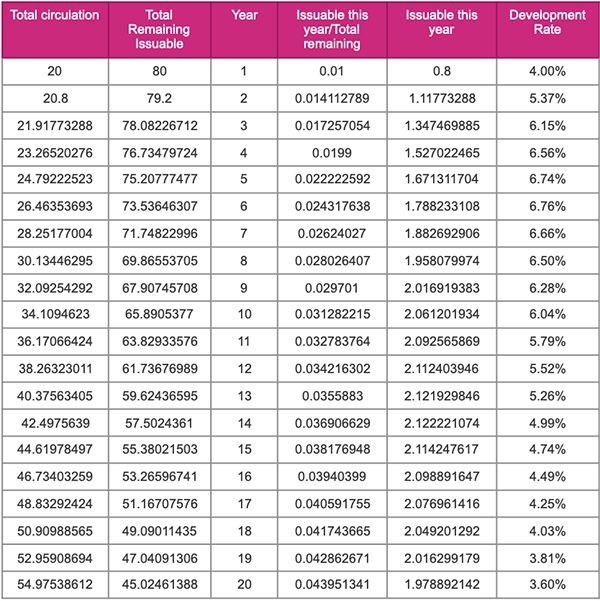

The native token for the Darwinia Network is RING, RING can be used as gas for transactions. Gas include transaction fees, contract execution fees, network bandwidth charges, storage fees, and more.

## Token Specification

- Name: Darwinia Network Native Token
- Symbol: RING
- Network:
  - Ethereum
    - Spec: ERC20
    - Precision: 18
    - Smart Contract Address（Ethereum): 0x9469d013805bffb7d3debe5e7839237e535ec483
  - Tron
    - Spec: TRC20
    - Precision: 18
    - Smart Contract Address（Tron): TL175uyihLqQD656aFx3uhHYe1tyGkmXaW
  - Darwinia Mainnet
    - Spec: Native
    - Precision: 9
    - Smart Contract Address: /
- Total Supply: Initial circulation (2 Billion)，hard cap (10 Billion) in around 40 years
  
> The initial supply of RING is 2 billion, the maximum supply(Cap) is 10 billion. Currently, Darwinia Mainnet and its transaction haven’t launched yet. The initial supply is recorded in the Darwinia Genesis File. ERC20 RING and TRC20 RING are tokens on other public blockchain derived from Native RING. Current circulating RING (including ERC20/TRC20 derived tokens) is around 1.6 billion.

- Inflation Model: New RINGs are minted and distributed through the staking system and treasure as block producing rewards at a variable rate, see Inflation Model section below.

## Token Allocation

- Financing: 30%（first round 10%, evaluation $10M, 20% remaining to be determined）
- Foundation: 20%（5 years vesting period starts when mainnet launch）
- Team: 15%（1 year vesting period starts after 1 year since mainnet lanuch）
- Business Development and Marketing: 15%
- Community: 20%（including airdrop）

## Circulation

### Overview

| Type                         | RING Quantity | Proportion |
| :--------------------------: | :-----------: | :--------: |
| Total Supply                 | 2000M         | 100%       |
| In Circulation_Individuals   | 29.2M         | 1.83%      |
| In Circulation_Institutions  | 263.69M       | 16.58%     |
| In Circulation_Staking Bound | 198.77M       | 12.50%     |
| Long Term Lock               | 1508.34M      | 69.09%     |

### By Network

| Type                         | RING Quantity |
| :--------------------------: | :-----------: |
| ETH Total Supply             | 1189.56M      |
| In Circulation_Individuals   | 21.5M         |
| In Circulation_Institutions  | 263.69M       |
| In Circulation_Staking Bound | 195.30M       |
| Long Term Lock               | 709.07M       |

| Type                         | RING Quantity |
| :--------------------------: | :-----------: |
| TRON Total Supply            | 401M          |
| In Circulation_Total         | 7.7M          |
| In Circulation_Staking Bound | 3.47M         |
| Long Term Lock               | 389.83M       |

| Type                          | RING Quantity |
| :---------------------------: | :-----------: |
| Darwinia Mainnet Total Supply | 400M          |
| In Circulation                | 0M            |
| Long Term Lock                | 400M          |

### Calculation:

CirculatingSupply = TotalSupply - Foundation - Gringotts - SwapBridge

RING Supply API: https://api.darwinia.network/supply/ring

### Contract
- TotalSupply
  - ERC20: 0x9469d013805bffb7d3debe5e7839237e535ec483
  - TRC20: TL175uyihLqQD656aFx3uhHYe1tyGkmXaW

- Foundation
  - ERC20: 0x4710573b853fdd3561cb4f60ec9394f0155d5105
  - TRC20: TDWzV6W1L1uRcJzgg2uKa992nAReuDojfQ

- Gringotts
  - ERC20: 0x649fdf6ee483a96e020b889571e93700fbd82d88
  - TRC20: TTW2Vpr9TCu6gxGZ1yjwqy7R79hEH8iscC

- SwapBridge
  - ERC20: 0x7f23e4a473db3d11d11b43d90b34f8a778753e34
  - TRC20: TSu1fQKFkTv95U312R6E94RMdixsupBZDS

## Inflation Model

After the Darwinia Network mainnet goes live, the total cap of the block reward (`MAX_BLOCK_REWARD_YEAR`) is adjusted once a year. The block reward of year N is `1 - (99 /100)^sqrt(N)` of total remaining issuable.

    Total remaining issuable RING = HARD_CAP - CURRENT_SUPPLY
    Supply in the next year = supply in the previous year + total actual reward in the year

The total number of `HARD_CAP` for RING is 10 billion.

According to the annual block reward limit and the block interval (in seconds), you can calculate the block reward toplimit (`MAX_BLOCK_REWARD`) for each block of the year.

    Block Reward Limit for Each Block = Total Reward Limit for the Year × Block Interval Time /Total Number of Seconds per Year ( 365 * 24 * 3600)

The following table shows RING’s Annual development statistics:

## Appendix:

### Appendix 1: Algorithm of Binding RING for KTON

Users can lock a certain amount of RING for a predefined period of time in exchange for KTON in return.  Basically bind 10,000 RING for 12 months to get 1 KTON. 

1-36 variable integer months(30days) as the locking period are allowed.  See the following table of rewarded KTON amount according to locked period.

| Month | KTON | Month | KTON | Month | KTON |
| :--: | :------: | :--: | :------: | :--: | :------: |
| 1    | 0.0761   | 7    | 0.5634   | 15   | 1.2842   |
| 2    | 0.1522   | 8    | 0.6446   | 18   | 1.5736   |
| 3    | 0.2335   | 9    | 0.7309   | 21   | 1.8832   |
| 4    | 0.3096   | 10   | 0.8223   | 36   | 3.6446   |
| 5    | 0.3959   | 11   | 0.9086   |      |          |
| 6    | 0.4771   | 12   | 1        |      |          |

### Appendix 2: Locked RING (ERC-20)

2021.2020.06.22-2021.05.22 Unlocking Plan（2020-05-22data）

| Date       | Cumulative unlockable quantity before this time | Date       | Cumulative unlockable quantity before this time |
|:----------:|:--------------------:|:----------:|:--------------------:|
| 2020-06-22 | 15,963,300           | 2020-10-22 | 41,240,661           |
| 2020-07-22 | 27,963,300           | 2020-12-22 | 41,260,661           |
| 2020-08-22 | 29,040,661           | 2021-02-22 | 41,266,661           |
| 2020-09-22 | 30,040,661           | 2021-05-22 | 41,270,761           |

**Contract**  
https://cn.etherscan.com/token/0x9469d013805bffb7d3debe5e7839237e535ec483?a=0x649fdf6ee483a96e020b889571e93700fbd82d88

### Appendix 3: Locked RING (TRC-20)

2021.2020.06.22-2021.05.22 Unlocking Plan(2020-05-22data）

| Date       | Cumulative unlockable quantity before this time |
|:----------:|:--------------------:|
| 2020-06-22 | 128,179              |
| 2020-10-22 | 132,479              |

### Appendix 4: WhitePaper
https://evolution.l2me.com/darwinia/Darwinia_Genepaper_EN_200430.pdf
