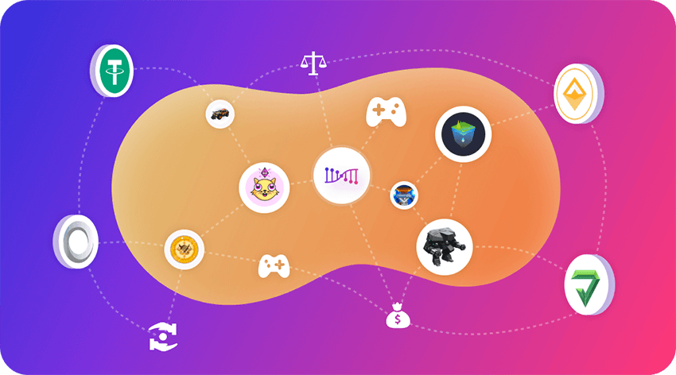

The world is being blockchainized and tokenized. Fungible tokens, which has been generally used in the financial industry, together with Non-fungible tokens, which are becoming more and more recognized in the game industry, will greatly enhance the openness and collaboration of finance and game sector.
These tokens are being connected and merged, and the ways of such connection and merger are trends to diversified  as well.  Such connections might be performed with smart contracts, Dapp, or appchain protocols, that lead to the formation of an open token-network. Darwinia Network powered by decentralized token bridges and decentralized backing technology via develop infrastructure and core-applications, to support the growth of the token-network. Darwinia focuses its major application in games and de-fi sector. 

