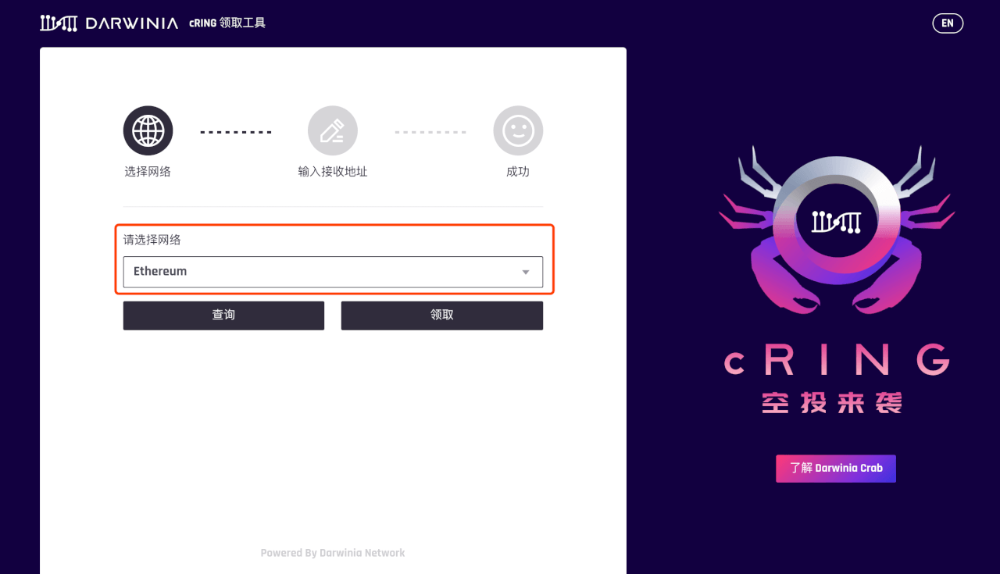
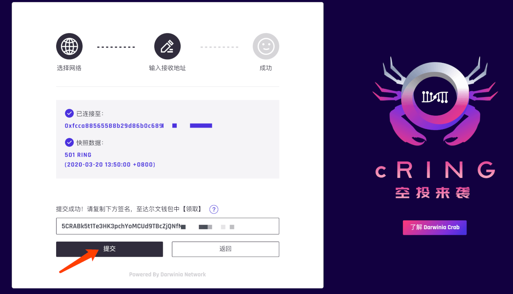

## 领取条件

Darwinia Crab 为模拟真实的网络生态，为 **RING (ERC-20 & TRC-20)** 和 **DOT (ERC-20)** 的持有者空投了Crab 网络的Token: CRING。  

空投将按快照时账号持有 RING（包括**RING余额**和**正在进行中的存单**）和 DOT 的数量进行投放，投放比例为：  
- **1RING -> 1CRING**
- **1DOT -> 50CRING**
- 快照时间为：**2020-03-20 13:50:00 （+0800）**  

## 准备

> 推荐在PC端使用 Chrome 浏览器 + Metamask / Tronlink 插件完成领取操作！

- Crab地址：https://apps.darwinia.network/#/account
> 如没有Darwinia Crab 地址，生成方式请参考: [如何创建或导入Darwinia Crab 地址](crab-tut-create-account)

- 插件下载地址：
  - Metamask: (https://metamask.io/)
  - Tronlink: (https://www.tronlink.org/)

## 查询空投数量

1、通过 Chrome 浏览器，访问: https://claim.darwinia.network/

2、选择想要查询的网络（以太坊/波场），点击【查询】。（下文以以太坊网络为例）

3、获得查询结果

## 领取CRING空投

1、通过 Chrome 浏览器或手机钱包，访问 CRING [领取工具](https://claim.darwinia.network/)

2、选择想要查询的网络（以太坊/波场），点击【领取】。（下文以以太坊网络为例）

3、填写接受 CRING 的 Darwinia Crab 地址，确认无误后，点击【提交】。

4、通过浏览器插件签名（签名不消耗燃料费）

5、成功获取签名信息，点击复制。（请注意保存签名信息，建议在成功接收空投前，暂时不关闭本页面）

6、打开[达尔文钱包-认领模块](<https://apps.darwinia.network/#/claims>)：<https://apps.darwinia.network/#/claims>,选中刚刚填写的接收空投的地址，点击【继续】。

7、将刚刚在 CRING Claim Tool 中生成的签名信息贴入，依次点击【确定认领】-【领取】-【签名】

8、领取成功后，您将收到如下提示。这时就代表您的空投已成功领取，可以到 [达尔文钱包-账户](<https://apps.darwinia.network/#/accounts>) 或 [subscan](<https://crab.subscan.io/>)中查看账户余额信息。

- 如果您在领取空投的过程中遇到其他问题，请加入我们的社群交流。
  - 微信公众号：DarwiniaNetwork
  - 微信小助手：Darwinia_Network
  - Telegram：<https://t.me/DarwiniaNetwork>
