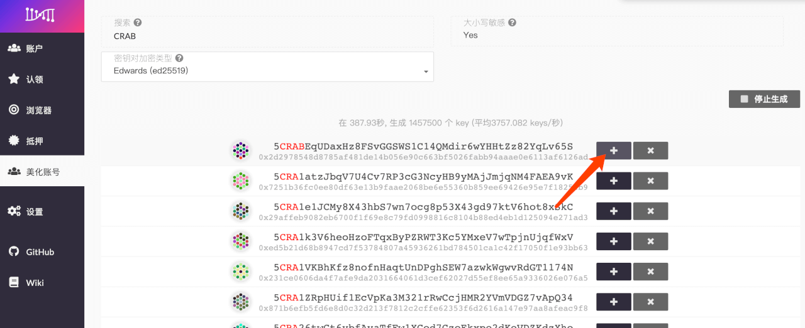

## 领取cRING

- 加入 Darwinia Faucet 频道：[点击此处](https://t.me/DarwiniaFaucet)
- 回复 /faucet 账号
  - 例如：/faucet 5CRABWXr1AqSSqJwv9tzh8gk4mEnrRYV9VWq7VnHh1KxvTBD
  - 注意：/faucet 和 账号 之间有空格，账号必须包含「CRAB」四个大写字母

- 如您的账号符合发放要求，将自动发放 1000 cRING 到您的账户，您可以到浏览器[crab.subscan.io](https://crab.subscan.io/)查看转账记录。
 

## Darwinia Faucet 发放规则

1）每个 Telegram 账号`24小时`内可以成功领取`1`次空投。  
2）每个crab网络地址最多领取`1`次空投。  
3）领取空投的地址需要包含`CRAB`四个字母（全部为大写）。  
4）空投每日最大发放量为`400`份，先到先得。  
5）每笔空投的数量为固定值：`1000` cRING。  

## 如何生成包含 CRAB 字母的账号

- 点击【美化账号】，填写您需要筛选的条件。

- 点击【开始生成】，等待账户生成，点击【 + 】选择您心仪的账户进行备份。

- 点击【保存】，根据你的使用习惯，选择备份原始种子或json文件。   

> 务必备份好`助记词、私钥、json文件`等。备份json文件时，请注意保管密码，密码丢失将无法通过json文件恢复地址，但可通过助记词、私钥重新导入。