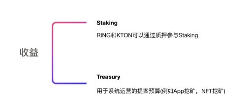

- 功能描述: 达尔文通证和 Staking 模型(Darwinia AppChain)
- 开始时间: 2019-05-23
- RFC PR: None
- Github Issue: None

# 概要
[summary]: #summary
这边设计稿介绍达尔文网络的通证和 Staking 模型。


# 原生资产
RING 是达尔文网络的原生资产，RING 可以作为交易的燃料费。燃料费包括交易费用，合约执行费用，网络带宽费用，存储费用等等。

RING 在达尔文网路主网上线时的供应量为 20 亿，之后将会通过出块奖励将新发行的 RING 分发 Staking 系统和 Treasury。

在达尔文主网上线后，该年的出块奖励每年调整一次，第 N 年的块奖励为剩余可发行供应量的 ```1 - (99 /100)^sqrt(N) ```。

```
剩余可发行总量 = 硬顶总量 - 当前供应量

下一年的供应量 = 上一年的供应量 + 该年实际出块奖励总和

```


RING 的硬顶总量为 100 亿。

根据每年的出块奖励，和出块间隔时间(单位：秒)，可以算出这一年的每个块的出块奖励。

```
每个块的块奖励 = 该年出块奖励 × 出块间隔时间 ÷ 每年总秒数(即 365 乘 24 乘 3600)
```

# 收益分配
达尔网络总收入包括出块奖励和达尔文网络交易手续费。达尔文网络交易手续费包括网络手续费，跨链服务质押费用，应用链链的接入费用，以及相关应用比如进化星球自主选择分配给达尔文网络的收入。

```
Staking = 系统收入 × Y
Treasury = 系统收入 × (1 - Y)
```

Treasury 主要用于支付系统提案预算，可能包括 NFT 挖矿或 App 挖矿等系统运营提案，Polkadot 槽位竞价激励，或者用于生态开发者支持。

备注: 系统 Staking 收益是达尔网络总收入的一个百分比 Y(Y 为系统参数)。
Staking
达尔文网络将会把主要收入作为激励分发给 Staking 的参与者。Staking 的过程也可以理解为 POS 挖矿过程，挖矿者通过质押资产来获得 Staking 能量来进行 POS 挖矿。

一般来说，用户可以通过质押基础资产 RING 来进行 POS 挖矿，如果用户开始取回 Staking 质押的 RING，那么挖矿将停止，解除质押的 RING 将需要 14 天时间可以完全到账。

Staking 按照简单和复杂程度，可以分为基础版和专业版。


# 氪石(KTON)

为了鼓励用户进行长期锁定和承诺投入，用户在 Staking RING 的过程中，可以承诺锁定 RING 3 - 36 个月，系统会给参与 Staking 的用户一个氪石的通证进行奖励，但在承诺锁定期间无法进行解锁 RING 操作(除非缴纳 3 倍的氪石罚金)。

因此，用户在使用 RING 进行 Staking 过程中，可以选择承诺锁定 RING 一段时间来获得氪石。氪石的初始供应量为零，但主网上线前进化星球应用已经开始锁定 RING 获得氪石，因此主网上线时将会存在一定的氪石供应量。最早通过锁定 RING 获得氪石的设计出现在进化星球古灵阁银行，相关的介绍可以参考古灵阁氪石模型[5]。

氪石可以用于质押获得 Staking 能量，所以同样也可以参与 POS 挖矿。用户通过质押氪石进行 Staking，如果用户开始取回 Staking 质押的氪石，那么挖矿将停止，解除质押的氪石将需要 14 天时间可以完全到账。


# Staking 算力

某账户的 Staking 算力代表此账户当前时间对 Staking 的贡献值大小，Staking 算力可以类比为 POW 中的算力。每个账户的算力值由该账户中质押的 RING 和 KTON 资产来决定，一旦解除质押，相应的算力也将消失。

账户的 Staking 算力比随其质押的资产多少不断变化，不能转移或者转账。Staking 参与者可以通过修改投票支持的验证人，在不需要解锁质押的情况下，更改投票支持的验证人。

算力值有可能还将在系统的治理和升级中扮演重要角色。(备注 2)


算力值占总算力值的比例称做算力占比。

```angular2
算力 = 总算力值 × 算力占比

该账户算力占比 = 算力占比(RING 部分) + 算力占比(氪石部分)
```


RING 和氪石贡献的算力占比计算公式如下：
```angular2
算力占比(RING 部分) = RING 算力贡献比例 × 质押中的 RING / RING 质押的总数

算力占比(氪石部分) = (1 - RING 算力贡献比例) × 质押中的氪石 / 氪石质押总数
```

该账户的 Staking 收益公式如下：
```angular2
账户 Staking 收益 = (达尔网络总收入 × Y) × 账户算力占比
```

该账户的投票权重公式如下：
```angular2
账户投票权重 = 总投票权重 ×  账户算力占比
```


备注 1:  RING 算力贡献比例默认为 0.5。

备注 2: 因为氪石可以转售给其他人，所以流动性的氪石可能无法完全代表长期承诺投入，只有承诺锁定和质押的”资产×天数”才能准确代表对达尔文网络的承诺投入。
Slash 算法

为了防止验证人进行攻击，或者出块不稳定，当攻击或者错误发生的时候，系统需要对验证人(包括投票人)质押的资产进行惩罚，惩罚的过程和机制就是 Slash 算法。

因为达尔文网络中实际存在 RING 和 KTON 两种质押资产，因此需要对 Slash 的算法进行一些补充说明。

Staking 系统中惩罚相关的参数将以百分比为单位，当 Slash 发生后，验证人或用户质押的资产将按照该百分比比例进行惩罚，无论其质押的资产是 RING 还是 KTON。

另外，在达尔文网路质押系统中，RING 存在四种主要状态，账户余额、Staking 中、锁定 Staking 中、解除质押中。因此存在两种质押状态的 RING 资产，即 Staking 中和锁定 Staking 中，并且锁定 Staking 状态的 RING 有可能存在不同的解锁到期时间。因此在 Slash 发生时，需要确定不同 RING 质押资产被 Slash 的先后顺序和优先级。Staking 系统将按照解锁到期的时间先后顺序，优先 Slash 那些较早到期的质押资产，也就是先 Slash 不在锁定状态的质押资产，然后 Slash 那些解锁时间先到期的质押资产。


# Staking 模型设计解释
[guide-level-explanation]: #guide-level-explanation

达尔文网络将会把全部收入作为激励分发给 Staking 的参与者。

达尔文网络的收入来源大体分为两种：

- 出块奖励(BLOCK_REWARD)，每年的块奖励上限随时间会减少，通胀率将会随着时间快速收缩和降低。
- 达尔文网络交易手续费(NETWORK_FEE)，包括开发者使用达尔文网络的跨链服务，达尔文网络平行链的接入费用，以及相关应用比如进化星球自主选择分配给达尔文网络的收入。

因为 Polkadot 网络采用共享池安全的模型，所以处于 Polkadot 连接模式时，平行链的安全性将由由中继链的验证人来保证，达尔文网络在此情况下不需要负责验证，只需要负责 Collator 即可。

因此，达尔文网络的 Staking 在这两种模式下的安全激励也会有很大不同，具体如下。Solo 模式收入分配

验证人和 KTON 持有者将会按照一个比例来分享进化星球的收入， KTON 持有者可以同时把自己的 KTON 投票给验证人，获取验证人部分的 Staking 激励。(Y 为系统参数，将会通过 KTON 投票的治理机制来设定)

```angular2
（锁定 KTON，全部 KTON, Treasury）= 

[ (块奖励上限 ×氪石锁定率 + NETWORK_FEE)×X% ,  (块奖励上限 ×RING 锁定率 + NETWORK_FEE)×Y%), (块奖励上限 + NETWORK_FEE) × (100-X-Y)% ]
```

Polkadot 连接模式收入分配

当达尔文网络打算连接至 Polkadot 网络时，根据 Polkadot Parachain Auction[4]的模型，达尔文中继链将需要锁定足够多的 DOTs 来参与 Parachain Slots 竞价，是否胜出只与锁定的 DOTs 多少有关，取决于当时的市场情况。为了获得足够的竞争力，达尔文网络将设计一种众筹锁定竞价机制，以激励达尔文社区参与者帮助竞价。
众筹锁定竞价

Polkadot 的 Parachain Slot 拍卖竞价允许任何类型的抽象账户参与竞价，包括普通地址账户，智能合约账户，平行链账户。这种广泛的抽象账户支持为参与竞价者提供了灵活性，可以设计各种去中心化的竞价模型。达尔文网络将为 Polka 连接模式设计一种通过众筹锁定 DOT 来参与 Parachain Slots 竞价的方式，众筹者不需要将 DOT 所有权进行转移，只需要将 DOT 锁定并提供锁定凭证，同时开放一定的投票或者竞价权限供达尔文中继链使用。参与竞价锁定的 DOTs 是安全的，因为整个过程是通过智能合约(或中继链)完成的，没有任何人可以控制这部分锁定的资产。

当达尔文网络切换至 Polkadot 连接模式时，达尔文网络不再需要自己的验证人，原来用来激励 KTON 锁定者 Staking 的部分将会被用来奖励那些帮助达尔文网络进行 DOT 锁定竞价的参与者，也就是说，达尔文社区的 DOT 持有者将可以通过提供 DOT 竞价锁定凭证，获得 RING 网络收入奖励。

```angular2
（达尔文竞价锁定 DOT，全部 KTON, Treasury）= 
[ (块奖励上限 + NETWORK_FEE) × X% ,  (块奖励上限 × RING 锁定率 + NETWORK_FEE) × Y% , (块奖励上限 + NETWORK_FEE) ×(100-X-Y)%) ]
```


## 其他架构参考

- [Cosmos Staking](https://blog.cosmos.network/economics-of-proof-of-stake-bridging-the-economic-system-of-old-into-the-new-age-of-blockchains-3f17824e91db)
- [Polkadot Staking](https://medium.com/polkadot-network/polkadot-proof-of-concept-4-arrives-with-new-ways-to-stake-3b27037346cc)
- [Polkadot Parachain Slot Auction](https://wiki.polkadot.network/en/latest/polkadot/learn/auction/)


# 参考和实现
[reference-level-explanation]: #reference-level-explanation

## 代码库

https://github.com/darwinia-network/darwinia/tree/develop/srml/staking

## 主要特性和创新[WIP]

- 支持 Solo 模式和波卡连接模式的无缝切换
- 二阶 Staking 模型：锁定的氪石相当于二阶的锁定 RING
- 氪石是根据古灵阁氪石利息算法生成的，鼓励长期锁定和长期投入者
- Staking 权益和投票权的通证化，Staking 后的锁定氪石即为投票权


# 缺点
[drawbacks]: #drawbacks

- 设计变更: 应用层面的流动性模型可以采取类似 Uniswap 模型的方案

# 理由[WIP]
[rationale-and-alternatives]: #rationale-and-alternatives


# 现有技术
[prior-art]: #prior-art

- https://github.com/evolutionlandorg/bank
- https://github.com/evolutionlandorg/darwinia-appchain/tree/master/srml/token

# 问题
[unresolved-questions]: #unresolved-questions

[WIP]


# 未来的可能性
[future-possibilities]: #future-possibilities

### KTON 虚拟银行未来商业拓展计划之贷款业务

当未来 RING 有足够的流动性，且虚拟银行中有锁定的 RING 的时候，任何玩家可以通过抵押足够(3 倍)的资产(例如 ETH)，向虚拟银行贷款，但是需要在贷款时支付氪石贷款利息 D。用户到期后，可以返回借出的 RING，换回抵押资产。

```
D(N, X, S) = R(N, X, S) * (贷款倍数) 暂定贷款倍数为 2
```

借贷者缴纳的氪石贷款利息将会被虚拟银行销毁。

任何时候如果虚拟银行发现抵押不充足(平仓线，低于 1.3 倍)时，任何人可以通过平仓动作，支付 RING 给虚拟银行，换回锁定的抵押物。(这个部分设计可以参考 MakerDAO)

氪石将作为 RING 长期持有者和价值投资者的奖励，在系统重要投票和系统创始道具购买上扮演重要角色，例如某些保留的地块，只能用氪石购买。


# 参考

- [1] [进化星球虚拟银行和氪石](https://forum.evolution.land/topics/55)
- [2] [PoW 的好处](https://mp.weixin.qq.com/s/-Va8Q8I6zTtpNdJImkslrg)
- [3] [年化利率](https://baike.baidu.com/item/%E5%B9%B4%E5%8C%96%E5%88%A9%E7%8E%87/5834305)
