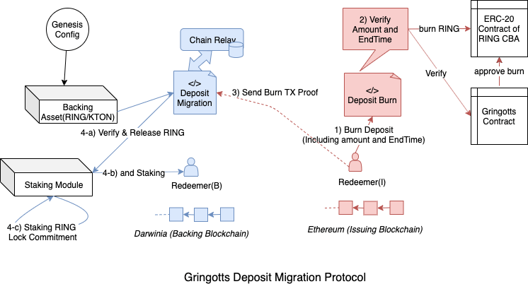

- rfc: 14
- title: 0014-darwinia-token-migration-by-cross-chain-redeem-protocol
- status: Draft
- desc: Darwinia Token Migration By Cross-chain Redeem Protocol
- 

# Darwinia Token Migration By Cross-chain Redeem Protocol

## I. 概述

在 Darwinia 主网上线之前，已经有一部分 RING/KTON 资产以 ERC20 或 TRC20 的形式存在于以太坊网络或者波场网络之中。从资产跨链的角度来看，因为 RING 和 KTON 是被定义成 Darwinia 网络的原生资产，因此这些 ERC20 Token 本质上是以某种形式跨链到以太坊网络上的，也可以理解为 CBA (Cryptocurreny Backed Assets)，也就是说，每个 ERC-20 RING 都有相应的 RING 被锁定在 Darwinia 主网上面，在主网上线之前，相应的背书资产即存在于创世块(Genesis)中。

RING 和 KTON 的 ERC20 Token 信息:

- RING Token Address: https://etherscan.io/token/0x9469d013805bffb7d3debe5e7839237e535ec483
- KTON Token Address: https://etherscan.io/token/0x9f284e1337a815fe77d2ff4ae46544645b20c5ff

本文将在[RFC-0012: Darwinia Bridge Core: Interoperation in ChainRelay Enabled Blockchains](./rfc-0012-darwinia-bridge-core-interoperation-in-chainrelay-enabled-blockchains)的基础上，讨论 Darwinia 主网上线后，ERC-20 形式的 RING 如何赎回至 Darwinia 网络，以及如何借助于 Darwinia 转接桥的设计，Token 将如何在 Darwinia 主网及其他公链中进行流转。


## II. 介绍

### A. 设计范围

- Darwinia 原生资产 RING/KTON 跨链设计。主要描述如何应用 ERC-0012 及相关跨链互操作协议，帮助 RING/KTON 实现在 Darwinia 网络和其他支持智能合约的网络(例如，以太坊、TRON、EOS)之间流转
- 创世块中管理背书资产。当 Darwinia 主网上线时，目前以 ERC20/TRC20 形式存在的 RING/KTON 对应的原生资产将会记录在创世块之中，并被背书管理模块锁定，用于支持后续外部资产的赎回。
- 背书管理模块的其他主要功能。背书管理模块还将满足主网上线后其他的跨链转账需求，例如后续用户如何将主网上的 RING/KTON 原生资产跨链到以太坊上。其发行出来的 ERC20 代币(代表 CBA)将与现有的 RING/KTON 合约共享同一个 ERC-20 智能合约。
- 外部链的发行合约和 chain relay。这部分方案的可行性依赖于 chain relay 的实现方案，主要是如何在以太坊上实现一个低成本可持续运行的 Darwinia Chain Relay，这部分的细节不在此处描述，具体可参考 RFV-0012 VI 章节。在以太坊实现了一个 Darwinia Chain Relay 的基础之上，外部链需要新增一个发型管理合约(Issuing Contract)用于接受 Darwinia 上的跨链转账交易证明，并通过 Darwinia Chain Relay 进行验证（包括交易存在证明，共识证明，交易内容证明等），在验证通过之后，进行相关的 RING/KTON 发行。这部分属于高级功能，其开发和实现可以独立于背书模块中的迁移功能，在最开始，可以先只支持单向的以太坊至 Darwinia 的赎回功能。
- Gringotts 合约的停止和存单迁移协议


### B. 术语

- **Genesis**， 创世块或表示区块链网络创世状态的账本数据。
- **CBA**, 全称 Cryptocurrency Backed Assets, 即有加密资产背书的资产，详细介绍可以参考 XClaim [1].
- **Chain Relay**,  Cross-Chain State Verification. It is capable of interpreting the statte of the backing blockchain B and provide functionality comparable to an SPV or light client. 主要用于验证外部区块链网络的交易存在性证明和共识证明。
- **Backing Contract/Module**，Backing Blockchain 中用于管理背书资产的合约或者模块，包括锁定和释放等功能，在 Darwinia 网络中 Backing Module 还负责管理锁定在创世块中的背书资产。
- **Chain Relay Module**, 实现在 Darwinia 上的针对外部区块链网络(例如 Ethereum/ Tron)的 Chain Relay.
- **External Darwinia Chain Relay**，存在于外部区块链网络上的针对 Darwinia Network 的 Chain Relay.
- **External Issuing Contract**, 用于在外部区块链网络中发行原生 RING/KTON CBA 的 ERC-20 Token.

### C. 背书资产 Genesis 配置

在 Darwinia 主网上线之时，就存在 CBA 背书资产，因此需要将 RING/KTON 在其他链上的资产背书信息定义在 Genesis Config 中，当主网上线之后，这些背书资产将会初始化相应原生资产，并将其锁定在背书合约中，供特殊赎回(迁移)协议使用。

需要注意的是，Genesis Config 总分发和锁定的 RING/KTON，将对应于主网上线时对应公链上 RING/KTON 的 Total Supply. 

Genesis Config 片段示例:

```json
{
  "backingAssets": {
    "Ethereum" : {
      "RING" : 100000,
      "KTON" : 50000
    },
    "Tron" : {
      "RING" : 3000,
      "KTON" : 200
    }
  }
}
```


### III. 通过特殊赎回协议实现 RING/KTON 迁移

当用户需要将 ERC-20 形式的 RING 通证转化成 Darwinia 主网上的 RING 的时候，其只需要将该部分 RING 发送一个 Token 销毁合约，在确认销毁成功之后，用户将该笔交易证明发送给 Darwinia 网路的解锁合约，解锁合约在验证完成之后，将会从背书资产模块中释放对应的 RING 通证给赎回者。


#### A. 与普通赎回协议的区别

RING/KTON 特殊赎回协议跟 Darwinia Bridge Core 中的普通赎回协议最大的区别在于背书资产(Backing Assets)。普通赎回协议中需要赎回的背书资产，都是之前通过发行协议锁定在 Backing Contract 里面的，但是在 RING/KTON 特殊赎回协议这里并没有先前的锁定发行 CBA 的过程，主网上线前的 ERC20 RING 对应的 Backing Assets 是通过创始块背书，进行分发和锁定。

创始块中锁定的原生资产用于支持原本已经在其他公链(Ethereum 和 Tron)上已经存在的 ERC20 形式的 RING/KTON 赎回功能。当用户需要拿回 Darwinia 主链上的原生背书资产时，他们只需要按照特殊赎回协议销毁背书资产对应的 RING/KTON CBA Token 就可以了。

#### B. Chain Relay SRML 模块

Chain Relay 是实现 Token 跨链转接桥的关键模块，类似于一个支持 SPV 的轻客户端。在像以太坊这样的智能合约公链中，Chain Relay 是用智能合约来实现的，例如[BTCRelay](https://github.com/ethereum/btcrelay)。对于 Darwinia 来说，因为是基于 Substrate 开发，支持 SRML 模块和链上升级，所以就多了一个选择，可以将 Chain Relay 的实现为 Darwinia 的一个 SRML，并针对不同的公链实现不同的 SRML 形式的 Chain Relay，以提供相应公链的跨链支持。

对于具体的实现，性能和成本是非常重要的考量，因此需要基于一些改进方案来帮助实现，相关改进方案在 RFC-0012 VI 章节详细描述。

#### C. Gringotts 合约的停止和存单迁移协议

Gringotts 合约实现:

https://github.com/evolutionlandorg/bank

Gringotts 合约功能中存 RING 得 KTON 的功能对应于 Darwinia Staking 模块中的承诺锁定得 KTON 的功能，Darwinia 主网上线后，这部分功能将从以太坊(或波场)Gringotts 智能合约迁移至 Darwinia 主网。

为了保证主网上线时和之后，其他公链上不会有新的 KTON 被通过定期存 RING 发行出来，因此，主网上线前 Gringott 合约功能将停止存 RING 得 KTON 功能，但是 RING 取回功能仍将保留。

此外，因为 Gringotts 存单中锁定了 RING，而这部分 RING 的持有者可能希望参与到 Darwinia Staking 中去，因此需要支持 Gringotts 存单迁移的功能，主要包括以下几个步骤(以太坊为例):

- 将存单以及存单中的 RING 一起销毁，销毁交易中需要包含存单 ID，锁定 RING 的数量，存单到期时间等关键参数证明，销毁合约将会对这些关键参数进行比对和校验，通过之后销毁存单的 RING Token。这样只需要证明交易被打包和存在，就可以从交易中解析出这些关键参数，并保证这些参数的正确性。

- 迁移者在确定这笔交易的成功和 Finalization 之后，将这个交易证明提交给 Darwinia 的存单迁移模块。

- Darwinia 的存单迁移模块在验证交易的正确性之后，将进行 Darwinia 上的剩余迁移步骤，包括 a)对应数量 RING 的解锁，b)将这些 RING 进行 Staking. c) 对这些 Staking 的 RING 进行承诺锁定.(区别于正常流程，这里不会有 KTON 奖励被发行，因为在以太坊中已经奖励过了)

  

### IV. 跨链转账的普通发行和普通赎回协议

对于 Darwinia 来说，不仅仅存在主网上线后的 Token 迁移需求，还存在将主网上原生的 RING/KTON 资产跨链到其他公链的需求。因此以太坊上的 ERC-20 RING 不仅可以通过迁移协议单向回到 Darwinia，也可以继续保留在以太坊上面，而且 Darwinia 上的 RING 还可以通过跨链转接桥作为 CBA 发行到以太坊上面成为 ERC-20 RING，这个过程将由普通发行和赎回协议完成，其协议流程和设计跟正常的 Token 跨链协议一样，没有太大区别。


## 参考


1. XClaim, https://eprint.iacr.org/2018/643.pdf
2. FlyClient, https://eprint.iacr.org/2019/226.pdf


