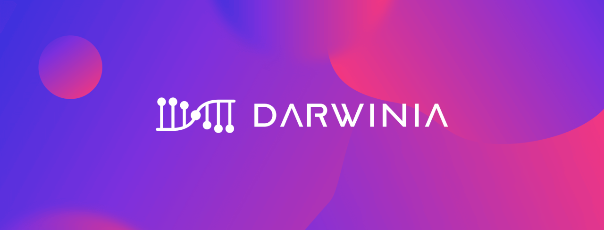

达尔文网络是基于 Substrate 开发的去中心化桥接网络，是跨链生态的金门大桥，提供最安全的通用桥接方案，可以实现波卡，以太坊，波场等异构链之间的资产跨链和通用远程链调用，主要应用领域包括 Defi，跨链 NFT 交易市场，游戏等。

达尔文网络在构建去中心化桥接链的道路上获得了很多荣誉和认可，包括被写入波卡轻白皮书，被选中加入 Substrate Builder Program 和 Web3.0 训练营，并因为突出的技术创新被 Parity 正式授予达尔文网络 Level 2 高级勋章。达尔文网络开发的工具和产品还获得了 3 个 W3F Grants。Polkadot 的创始人 Gavin 也提到，Darwinia 是“最值得关注的波卡生态项目”之一。

达尔文网络一直在构建一个无许可的非托管桥接协议，特点是效率高、成本低、去中心化跨链资产，NFT 转账和其他跨链服务。

达尔文桥解决方案集成了超轻客户端、零知识和乐观博弈验证机制等技术。

达尔文桥与其他桥的不同之处在于，大桥的质量和去中心化程度方面更高，能够承载高价值的跨链资产传递。

