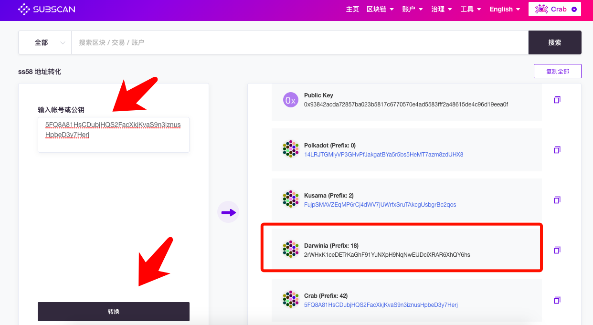

由于Darwinia 主网暂未发布，现阶段获得Darwinia 主网地址需要由Crab网络的地址进行转换

## 流程：
  - 1、注册【Darwinia Crab】网络地址
  - 2、利用【ss58小工具】将【Crab 地址】转换成【Darwinia 主网地址】

## 详细操作：
- 注册【Darwinia Crab】网络地址

进入[Darwinia Crab Web Wallet](https://apps.darwinia.network/#/account)，可在「账户」栏看到「添加账号」和「使用JSON恢复」两个按钮。

点击「添加账号」，在设置完账户基本信息后，点击「保存」按钮。（默认只显示“助记词“，”私钥“需切换）

点击「创建并且备份账户」按钮，备份该账户“json文件”

> 务必备份好`助记词、私钥、json文件`等。备份json文件时，请注意保管密码，密码丢失将无法通过json文件恢复地址，但可通过助记词、私钥重新导入。

- 将【Crab 地址】转换成【Darwinia 主网地址】

进入[ss58 小工具](https://crab.subscan.io/tools/ss58_transform)，将你的【Crab 地址】粘贴进转换框，点击[转换]按钮，可以看到你在Polkadot生态各个网络的地址都会列出。找到【Darwinia (Prefix: 18)】，这个地址就是你【Darwinia 主网地址】

