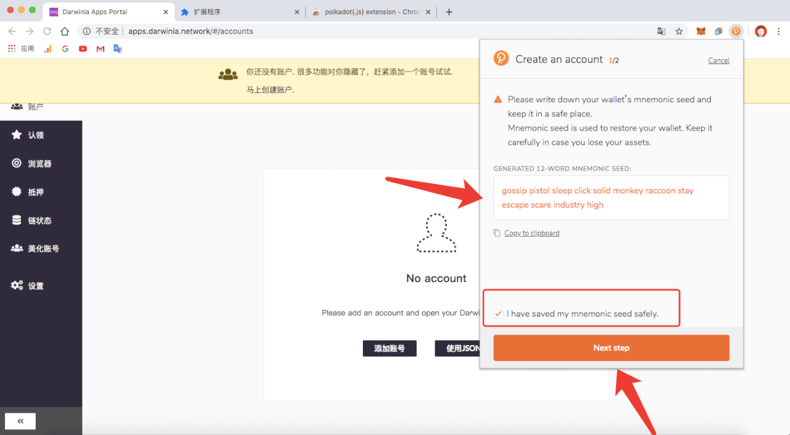

创建Darwinia账号的方法有多种，主要有三种，1. 通过Darwinia Web Wallet， 2. 通过Polkadot.js 浏览器插件，3. 通过Subkey命令行工具 ，下面将分别描述。您可以根据自己的喜好选择其中一种。如果您之前创建过账号，则可直接通过 “助记词/私钥/json文件” 等恢复/导入账号。 

  <!--DOCUSAURUS_CODE_TABS-->
  <!--Darwinia Web Apps-->

### Darwinia Web Wallet

**切换到主网**

进入[Darwinia Web Wallet](https://apps.darwinia.network)，点击左上角的达尔文图标。在对话框里选择Darwinia Network:


**新建账号**

可在「账号」栏看到「添加账号」和「使用JSON恢复」两个按钮。


点击「添加账号」，在设置完账号基本信息后，点击「保存」按钮。（默认只显示“助记词“，”私钥“需切换）


点击「创建并且备份账号」按钮，备份该账号“json文件”


> 务必备份好`助记词、私钥、json文件`等。备份json文件时，请注意保管密码，密码丢失将无法通过json文件恢复地址，但可通过助记词、私钥重新导入。

**通过json恢复账号**

如之前创建过账号，且备份有json文件，可直接选择「使用JSON恢复」。


**通过「助记词」恢复账号**

如忘记JSON文件密码，可通过「助记词」进行恢复。点击「添加账号」，将助记词替换成原先账号的助记词即可。（名称和密码均可重新设置）


**生成自定义账号**

如您需要生成一个包含特定字母开头的 Darwinia 账号，可参考一下教程：
   > 此类账号多用于记忆和美观的需要。
- 点击【美化账号】，填写您需要筛选的条件


`搜索` 在此处输入您希望包含的地址，该工具将生成密钥并显示与您的搜索最匹配的关联地址。

`大小写敏感` 搜索的内容是否区分大小写。

`密钥加密类型` 选择账号的加密类型，session 账号只能使用 Edwards (ed25519) 。

- 点击【开始生成】，等待账号生成，点击【 + 】选择您心仪的账号进行备份。


- 点击【保存】，根据你的使用习惯，选择备份原始种子或json文件


   > 务必备份好`助记词、私钥、json文件`等。备份json文件时，请注意保管密码，密码丢失将无法通过json文件恢复地址，但可通过助记词、私钥重新导入。


  <!--Polkadot.js 浏览器插件-->
### 通过Polkadot.js 浏览器插件

**安装浏览器插件**

浏览器插件可用于 [Google Chrome](https://chrome.google.com/webstore/detail/polkadot%7Bjs%7D-extension/mopnmbcafieddcagagdcbnhejhlodfdd?hl=en) and [FireFox](https://addons.mozilla.org/en-US/firefox/addon/polkadot-js-extension).


**新建账号**

单击扩展程序打开 “账号管理” 对话框，单击「创建新账号」按钮，然后按照说明进行操作。




> 确保将助记词安全保管。


  <!--Subkey CLI-->
### Subkey

对于熟悉命令行和Rust代码的高级用户，建议使用Subkey。Subkey允许您在可以编译代码的任何设备上生成密钥。Subkey可能对使用自动运行的设备（而不是运行iOS或Android的设备或其他特定用途的设备）的自动生成账号有用。不建议一般用户使用。

安装Subkey [install Subkey](https://substrate.dev/docs/en/ecosystem/subkey#more-subkey-to-explore), 运行：

```bash
$ curl https://getsubstrate.io -sSf | bash -s -- --fast
$ cargo install --force --git https://github.com/paritytech/substrate subkey
$ cargo build -p subkey
```

成功安装Subkey后，运行：

```shell
subkey -n substrate generate
```

您应该看到类似下面的信息弹出： **save all of this information somewhere secure you will not be able to recover your account if you lose your phrase or seed.**

```text
Secret phrase `destroy vague trend estate person civil cattle lab hockey tooth error pigeon` is account:
  Network ID/version: substrate
  Secret seed:        0x58e57817a2ccfa696ed6c3735d4cc4646f894bf7daf51a94f0c4702a92e40710
  Public key (hex):   0x225ce1f9c178189d2a977a195f822ebbfb538b317f23f83ab35605fb009fa438
  Account ID:         0x225ce1f9c178189d2a977a195f822ebbfb538b317f23f83ab35605fb009fa438
  SS58 Address:       2owvscruh7PNbykGLMZPxHyjYdi1Ryanrm4PTxVKh85Ef8Dn
```

> 如果您之前为除 “Substrate” 或 “Crab网络” 之外的其他网络创建了账号，则需要从之前的“秘语”或“秘密种子”中得出正确的“地址”。您可以使用`subkey -n substrate inspect "YOUR SECRET PHRASE HERE"`来获取Crab网络ID地址（SS58）。

  <!--Polkadot.js Web Apps-->
### Polkadot.js Web Apps
TODO：支持达尔文网络的完整指南

  <!--Mobile Wallet-->
### ~~Itering ID Wallet~~

Coming soon.

### ~~Math Wallet~~

Coming soon.

  <!--END_DOCUSAURUS_CODE_TABS-->

## 安全存储密钥

> **免责声明：密钥安全性**
您的私钥/助记词是访问您账号的唯一方法，你必须保证它的隐秘和安全。  
如果您与任何人分享私钥/助记词，他将能够完全访问您的账号，包括所有资金。因此，这个私钥/助记词是黑客和其他恶意攻击者的目标，有意窃取您的资金。  
我们建议您使用多种账号的生成方式，保证便利性和折衷的安全性。  
在填写您的地址之前请仔细阅读此页面，以便您了解选择不同的账号生成方式的风险以及如何适当缓解它们，来保证您的资金安全。

私钥/助记词是您进入账号的“关键”。知道私钥/助记词可以让您或任何人，知道种子的其他人可以重新生成和控制此账号。

必须将种子存储在安全，秘密和安全的地方。 如果如果您无法访问自己的账号，则可以通过输入种子来重新创建它。 这个也意味着其他人可以控制您的账号获取您的种子。

为了保证安全性最大化，应将种子记录在纸上或其他非数字设备上，并存储在安全的地方。 您可能还希望保护种子免受物理损坏（例如，通过密封保存）

防止水损坏的塑料袋，将其存放在防火保险箱中等）。建议您存放种子的多个副本位于不同的地理位置（例如，一个放在您的家庭保险箱中，另一个放在您银行的保管箱）。

您绝对不应将种子存储在可以访问互联网或将来可以访问互联网的任何类型的计算机上。
