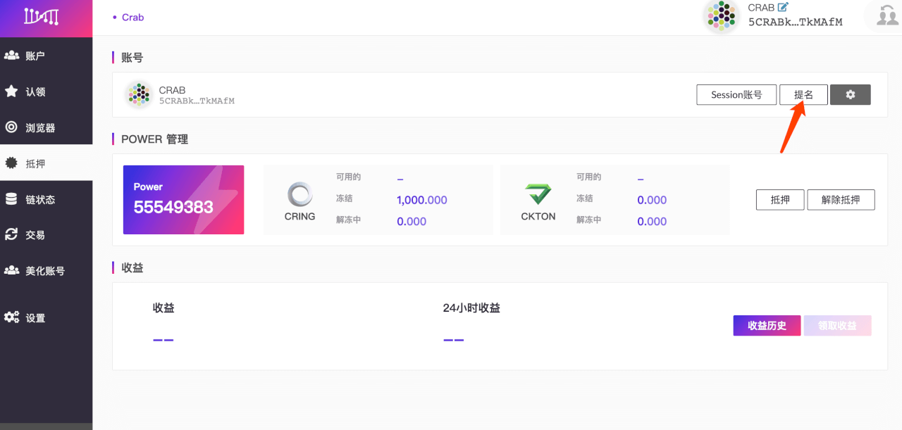
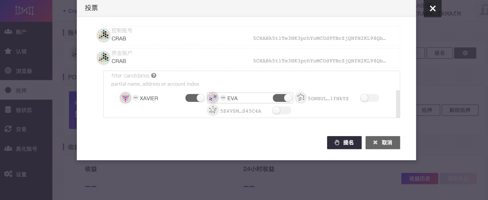
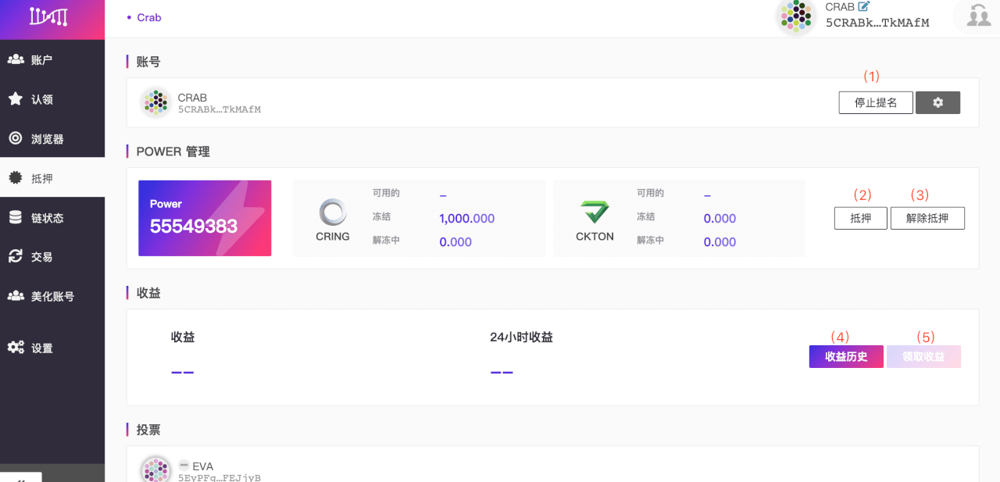

> - Staking是基于 PoS（Proof of Stake/权益证明）的共识机制，代币持有人通过质押、投票、委托和锁定等行为获取收益。

> - Darwinia 地址内需准备少许 RING，作为交易手续费。

## Start Staking

- 进入[Darwinia Web Wallet](https://apps.darwinia.network)，点击左侧【抵押】栏目， 点击【开始 staking 】  

- 填写Staking参数  

- `资金账户` 保管资金的账号，参与 staking 的代币将来自这个账户，此账户的操作多与资金变动相关。
- `控制账户` 管理 staking 其他操作的账号，如参与投票、参与验证等。
  
  > `资金账户`和`控制账户`可设置为同一账户，如果您持有较多代币或对安全性要求较高，建议此处设置为不同账号。  

-  `冻结数量` 参与 staking 的代币数量，这部分代币将被暂时冻结，解冻需要 14 天的解冻期；您可以选择冻结 RING 或 KTON。
- `收益账号` 接收 staking 收益的账号
- `冻结期限` 可选项；将 RING 承诺冻结 1-36 个月，可以获得额外的 KTON 奖励。(承诺锁定需接受用户条款)
  
  > 如提前赎回有承诺期限的 RING，需要支付获得奖励 **3** 倍的 KTON 惩罚 (在 KTON 不足的情况下，不可以使用 RING 来代缴罚金)。

- 填写好staking参数后，请点击【冻结】，签名并提交。  

## 提名验证人

- 完成 staking 参数后，在本页面点击【提名】  

  
    > 验证人和提名人的身份是互斥的，不可并存。如果您正在参选验证人，需要先取消参选验证人，再进行后续的提名操作。

- 选择中意的验证人  

- 签名并提交  

- 查看已提名验证人的相关信息  

    > 提名验证人的操作，会在下一个 era开始时生效，暂时延迟为正常现象。

## 其他操作

staking 还有一些其他操作，用于以下用途：  

- `停止提名` 取消所有投票。
- `抵押`  增加 staking 冻结的代币，用来获得更多的票权（power）。
- `取消抵押` 解冻 staking 的代币，与此同时票权（power）也会按比例减少。

  > 取消抵押需要 14 天的解冻期，处于解冻期内的代币不能进行任何操作，请谨慎处理。

- `收益历史` 去 SUBSCAN 浏览器查看历史收益记录
- `领取收益` 手动领取已获得的收益，收益将以 era 为单位发放。

  > 请注意：收益会保存 56 个 era（约 56 天），超期将无法领取。
  
- `更改控制账户` 更改用于管理 staking 其他操作的账号，如参与投票、参与验证等。
- `更改收益账号` 更改用于接收 staking 收益的账号
- `设置 session keys` 如果要升级成为验证人，需填写此项。[如何成为验证人](https://docs.darwinia.network/docs/zh-CN/wiki-tut-validator)
- `设置链上身份` 设置您的个人信息，如昵称、邮箱、网站、twitter、riot 等信息，其他用户可查看此信息并联系您。
