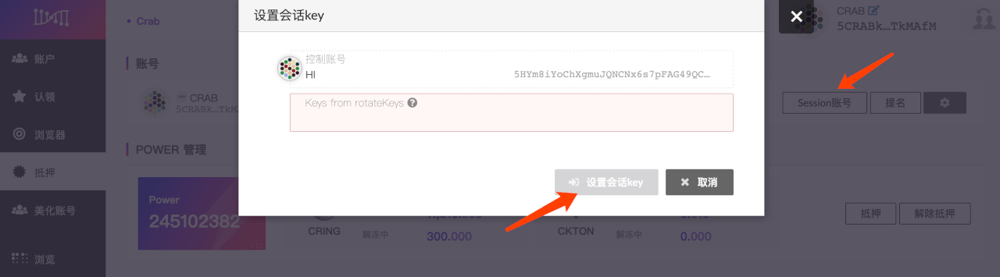
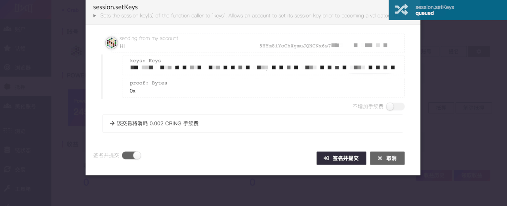
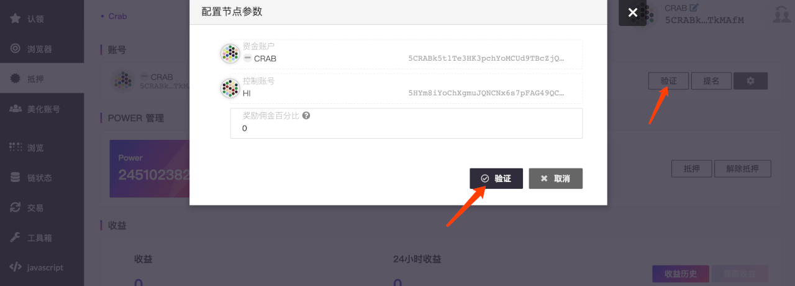

> - Staking是基于PoS（Proof of Stake/权益证明）的共识机制，代币持有人通过质押、投票、委托和锁定等行为获取收益。

> - Darwinia 地址内需准备少许 RING ，作为交易手续费。

本文将帮助您从头开始运行validator节点并成为validator。

## 运行你的validator节点

确保有`--unsafe-rpc-external --rpc-methods=Unsafe`参数，这是为了下一步调用节点的`author_rotateKeys`接口：

```bash
docker run -it -v <DIR>:/data -p 30333:30333 -p 9933:9933 darwinianetwork/darwinia:v0.x.x-x.x --name <NAME> --base-path /data --validator --unsafe-rpc-external --rpc-methods=Unsafe
```

## 生成你的 session keys

在你的节点所在的命令行下运行如下命令：

```json
curl http://127.0.0.1:9933 -H "Content-Type:application/json;charset=utf-8" -d \
'{
  "jsonrpc":"2.0",
  "id":1,
  "method":"author_rotateKeys",
  "params": []
}'
```

如果没有问题，那么会返回类似下面的结果：

```json
{"jsonrpc":"2.0","result":"0xba99ecfb4a87357a44ee2765cf617a6d81adf8f43e522db52e348d2f9d45ccde12d53d562e14bb18522fbc3032b786f44b2b92240f4756386d4baec68bbfb882bbabcce1440c84d7f5b67c8ecb956345100d5dbd07adfeba3d9482f95d9dec6c68d085323e61590f850c38244dd2c2bc4055548d9edfd0471f47da7667c17fe8","id":1}
```

里面的result就是你需要的session key了。

还有另外一种通过页面钱包生成session key的方法，[查看](click to view)。

## Staking

### 入口

- 进入[Darwinia Web Wallet](https://apps.darwinia.network)，点击左侧【抵押】栏目，点击【开始 Staking】


### 填写staking参数


- `资金账户` 保管资金的账号，参与 Staking 的代币将来自这个账户，此账户的操作多与资金变动相关。
- `控制账户` 管理 Staking 其他操作的账号，如参与投票、参与验证等。
  
  > `资金账户`和`控制账户`可设置为同一账户，如果您持有较多代币或对安全性要求较高，建议此处设置为不同账号。  

- `冻结数量` 参与 Staking 的代币数量，这部分代币将被暂时冻结，解冻需要 **14** 天的解冻期；您可以选择冻结 RING 或 KTON。
- `收益账号` 接收 Staking 收益的账号
- `冻结期限` 可选项；将 RING 承诺冻结 **1-36** 个月，可以获得额外的 KTON 奖励。(承诺锁定需接受用户条款)
  
  > 如提前赎回有承诺期限的 RING，需要支付获得奖励 **3** 倍的 KTON 惩罚 (在 KTON 不足的情况下，不可以使用 RING 来代缴罚金)。

填写好 Staking 参数后，请点击【冻结】，签名并提交。  


### 设置 session key

点击【session 账号】，输入刚刚生成的 session key ，点击【设置session key】提交。
> session key 务必填写真实数据，否则会导致漏块，从而收到经济惩罚。



**确认无误后，点击【签名并提交】** 


> 验证人和提名人的身份是互斥的，不可并存。如果您正在提名其他验证人，需要取消提名操作后，再进行后续的操作。

**点击【验证】，开始设置验证人参数**

- `奖励佣金百分比` 设置本节点优先分配收益的比重，范围为 **0-100%**。（例：如设置了 **5%** 的奖励佣金，本节点将优先获得节点收益的 **5%**，剩下 **95%** 的节点收益，将依据验证人和投票人抵押的金额，按比例分配；也就是说，`验证人的收益 = 节点奖励佣金 + 抵押奖励分成`）



**确认无误后，点击【签名并提交】**


**去【浏览器】查看当前验证人的相关信息**


> 参选验证人后会进入【候选】队列，在进入下一个 era 的时刻参与选举。

### (可选步骤) 重启你的validator节点

为了安全起见，你最好去掉rpc unsafe相关的参数后重启你的节点：

```bash
docker run -it -v <DIR>:/data -p 30333:30333 darwinianetwork/darwinia:v0.x.x-x.x --name <NAME> --base-path /data --validator
```

## 其他操作

**Staking 还有一些其他操作，用于以下用途：**

- `停止验证` 退选验证人。
- `抵押`  增加 Staking 冻结的代币，用来获得更多的票权（power）。
- `取消抵押` 解冻 Staking 的代币，与此同时票权（power）也会按比例减少。

  > 请注意：取消抵押需要 **14** 天的解冻期，处于解冻期内的代币不能进行任何操作，请谨慎处理。

- `收益历史` 去 SUBSCAN 浏览器查看历史收益记录。
- `领取收益` 手动领取已获得的收益，收益将以 era 为单位发放。

  > 请注意：收益会保存 **56** 个 era（约 **56** 天），超期将无法领取。
  
- `更改控制账户` 更改用于管理 Staking 其他操作的账号，如参与投票、参与验证等。
- `更改收益账号` 更改用于接收 Staking 收益的账号。
- `设置 session key` 更改 session key，请谨慎操作。
- `设置链上身份` 设置您的个人信息，如昵称、邮箱、网站、twitter、riot 等信息，其他用户可查看此信息并联系您。