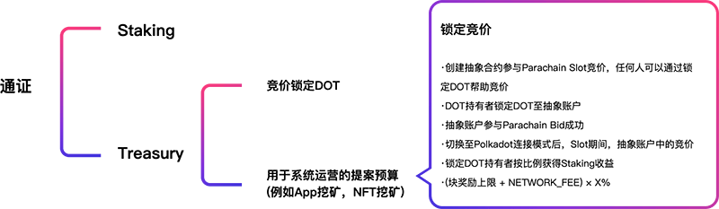

在 Polkadot 模式下，达尔文桥接链将作为 Polkadot 的平行链。

因为 Polkadot 网络采用共享安全的模型，所以处于 Polkadot 连接模式时，平行链的跨链安全性将由 Polkadot 中继链的验证人来保证，达尔文网络在切换至连接模式后，原先的验证人和 Staking 机制将用于保证达尔文网络内部的局部共识，这样有助于帮助实现更快的块确认和更高的 TPS。这套局部共识机制也将帮助 Collator 来确定提交给 Polkadot 验证人的区块不会违反 Polkadot 全局共识。

### Polkadot 槽位竞价激励提案

在连接模式下，达尔文网络可以基于这种设计发起提案，将提供一部分奖励，用于支持那些帮助达尔文网络进行 DOT 锁定竞价的参与。

当达尔文网络切换至 Polkadot 连接模式时，达尔文社区的DOT持有者将可以通过提供 DOT 竞价锁定凭证，获得达尔文网络的提案奖励。

