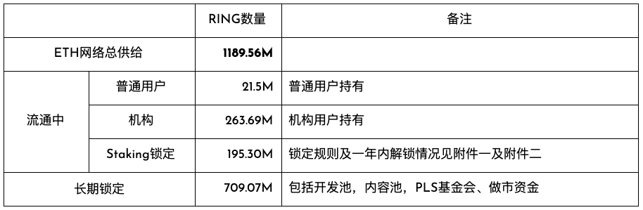
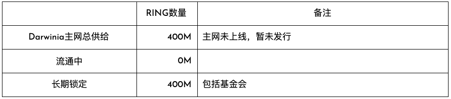

RING是达尔文网络的原生资产，RING可以作为交易的燃料费。燃料费包括交易费用，合约执行费用，网络带宽费用，存储费用等等。

## 代币详细信息

- 英文全称：Darwinia Network Native Token
- 符号：RING
- 网络：
  - Ethereum（以太坊）
    - 类型：ERC20
    - 精度：18
    - 智能合约地址（Ethereum)：0x9469d013805bffb7d3debe5e7839237e535ec483
  - Tron（波场）
    - 类型：TRC20
    - 精度：18
    - 智能合约地址（Tron)：TL175uyihLqQD656aFx3uhHYe1tyGkmXaW
  - Darwinia Mainnet（暂未发行）
    - 类型：Native
    - 精度：9
    - 合约地址：暂无
- 总量：初始发行量20亿（2 Billion），硬顶100亿（10 Billion，约40年达到）。
> Native RING（主网RING）是记在 Darwinia Genesis 里面的，还没有上线和开启转账，但是 Darwinia 之前有发行 ERC20 和 TRC20 的 RING Token，是由记录在 Genesis 里面的 RING 背书和发行的，Darwinia 主网上线后，可以兑换成 Native RING。目前流通的 RING 总量（包括 ERC20 和 TRC20，包括锁定的）大约 16 亿。

- 增发方式：RING在达尔⽂网络主⽹上线时的供应量为20亿（2 Billion)，之后将会通过出块奖励将新发⾏的RING分发Staking系统和Treasury。

## 目前流通情况

### 总览

### 按网络分布细分

## 通胀模型

在达尔文主网上线后，该年的出块奖励每年调整一次，第N年的块奖励为剩余可发行供应量的 `1 - (99 /100)^sqrt(N)`

        剩余可发行总量 = 硬顶总量 - 当前供应量
        下一年的供应量 = 上一年的供应量 + 该年实际出块奖励总和

RING的`硬顶`总量为100亿。

根据每年的出块奖励，和出块间隔时间(单位：秒)，可以算出这一年的每个块的出块奖励。

        每个块的块奖励 = 该年出块奖励 × 出块间隔时间 ÷ 每年总秒数(即365乘24乘3600)

下面是预估的每年通胀率统计表：

## 附件

### 附件一：锁RING得KTON的规则。

锁定10,000 RING，12个月可获得1个KTON。可选择1-36整数月(30天)，其他月份见下表。（月份选取1-12月及15、18、21、36为例）

| 月数 | 获得KTON | 月数 | 获得KTON | 月数 | 获得KTON |
| ---- | -------- | ---- | -------- | ---- | -------- |
| 1    | 0.0761   | 7    | 0.5634   | 15   | 1.2842   |
| 2    | 0.1522   | 8    | 0.6446   | 18   | 1.5736   |
| 3    | 0.2335   | 9    | 0.7309   | 21   | 1.8832   |
| 4    | 0.3096   | 10   | 0.8223   | 36   | 3.6446   |
| 5    | 0.3959   | 11   | 0.9086   |      |          |
| 6    | 0.4771   | 12   | 1        |      |          |

### 附件二：锁仓中的RING（ERC-20）2020.06.22-2021.05.22 释放计划介绍。（2020-05-22数据）

| 日期       | 该时间之前累计可解锁 | 日期       | 该时间之前累计可解锁 |
|------------|----------------------|------------|----------------------|
| 2020-06-22 | 15,963,300           | 2020-10-22 | 41,240,661           |
| 2020-07-22 | 27,963,300           | 2020-12-22 | 41,260,661           |
| 2020-08-22 | 29,040,661           | 2021-02-22 | 41,266,661           |
| 2020-09-22 | 30,040,661           | 2021-05-22 | 41,270,761           |

**合约**  
https://cn.etherscan.com/token/0x9469d013805bffb7d3debe5e7839237e535ec483?a=0x649fdf6ee483a96e020b889571e93700fbd82d88

### 附件三：锁仓中的RING（TRC-20）2020.06.22-2021.05.22 释放计划介绍。（2020-05-22数据）

| 日期       | 该时间之前累计可解锁 |
|------------|----------------------|
| 2020-06-22 | 128,179              |
| 2020-10-22 | 132,479              |

### 附件四：白皮书链接
https://evolution.l2me.com/darwinia/Darwinia_Genepaper_EN_200430.pdf
