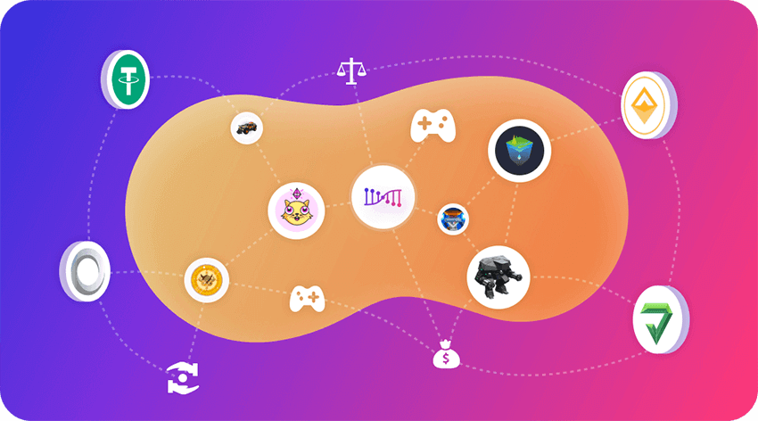

世界正在被区块链化和通证化，通证不仅包括在开放金融领域广泛应用的同质通证(代币)，也包括正在游戏行业被越来越多使用的非同质通证(NFT)，区块链将极大的提升游戏和金融世界的开放性和协作性。

这些通证正在以可信的方式互相连接融合，融合的方式也正在变得多样化，可能是以智能合约 Dapp 的形式，也有可能是以构建应用链协议的方式，一个开放的通证互联网正在慢慢形成，达尔文网络以去中心化桥接技术和去中心化背书技术为基础，通过构建基础设施和核心应用，支持通证互联网发展壮大，主要的应用领域包括开放游戏和开放金融等。

