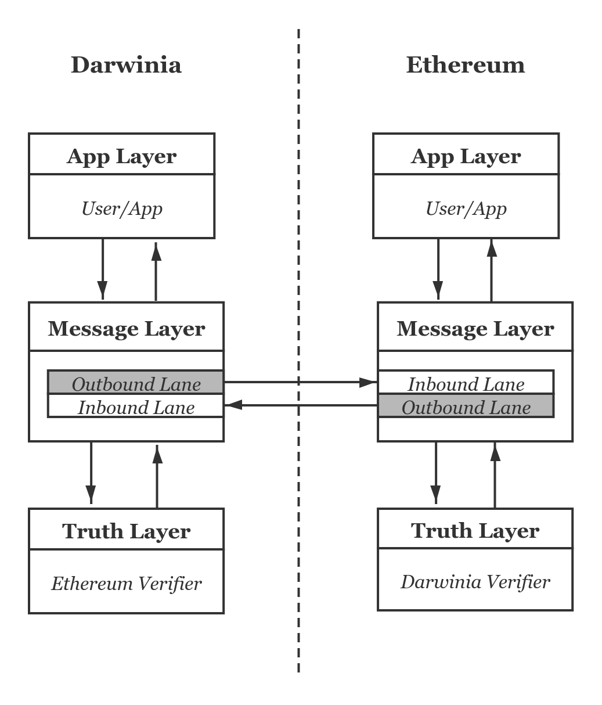
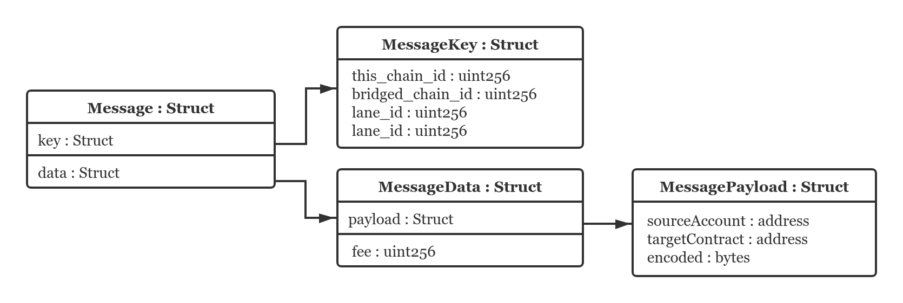
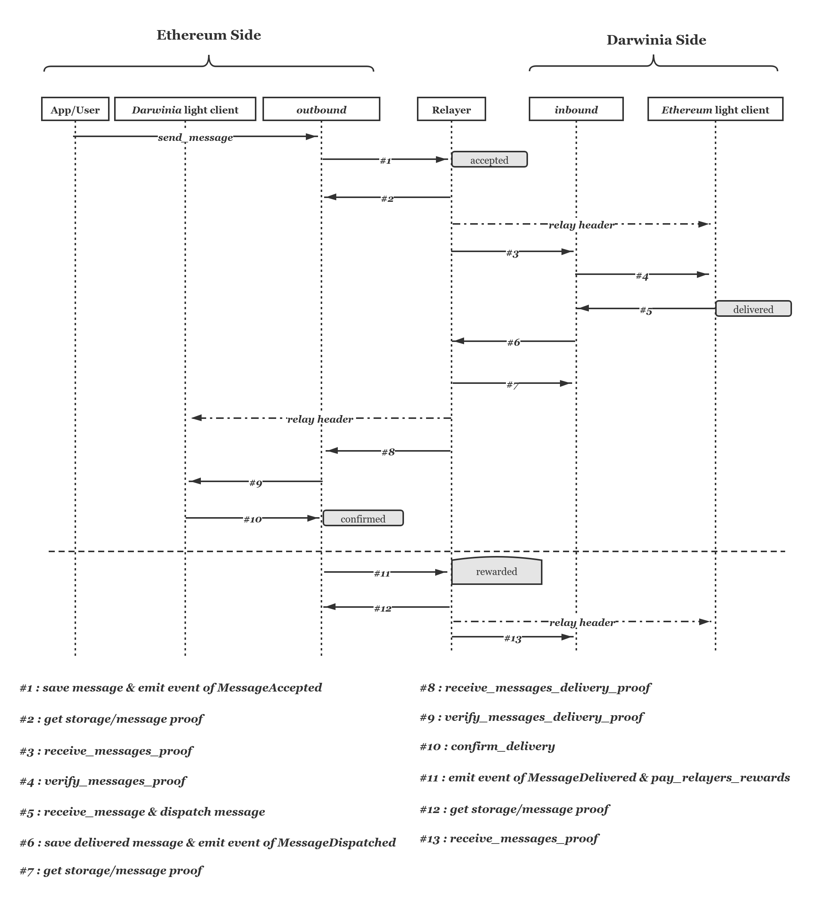

In the layered structure of a cross-chain bridge, an ideal message protocol should be as consensus-agnostic and application-agnostic as possible. In this article, we will introduce our new version of the design of Ethereum-Darwinia bridge in this direction.

## Concepts

### Source chain and target chain

The ***source chain*** is the network from which messages are generated, while the ***target chain*** refers to the network where messages are delivered.

### Message

An application in the ***source chain*** uses a ***message*** to call a function with parameters in the ***target chain***. Like a remote procedure call (RPC), a message contains data that identifies the source application, the target application, and a valid `encoded` that the target application expects to understand.

### Channel

A channel is responsible for the unidirectional delivery of ***messages*** from the ***source chain*** to the ***target chain***, comprising an `outbound` lane in the source chain and an `inbound` lane in the target chain. Users or applications wanting to transfer ***messages*** to another blockchain must submit the ***messages*** to a particular channel. The message layer consists of multiple channels and provides a variety of protections, including replay protection and ordered or unordered delivery of ***messages***.

### Relayer

A ***relayer*** is an off-chain actor who connects to both the source chain and the target chain and faithfully transfers the data between the source chain and the target chain.

## Message Workflow

The message protocol can be implemented with smart contracts or a module in the runtime. It is at the discretion of developers. Since our DVM(Darwinia Virtual Machine)  is Ethereum compatible, we have implemented the protocol in smart contracts on both sides of the bridge. We will explain the complete lifecycle of a cross-chain message in conjunction with a time sequence diagram and the data structure of *message*. 

The data structure for *message* is as follows:

It contains two *struct*s in it, key(*MessageKey*) and data(*MessageData*). From its members, we can see that the struct *MessageKey* uniquely identifies a message in storage. The struct *MessageData* represents an asynchronous call that a submitter(a user or an application) wants to make on a smart contract in another blockchain.

A *message* is generated by a smart contract(in the source chain) and then delivered to a smart contract (in the target chain) and eventually processed by this remote smart contract. Theoretically, `encoded` in the struct *MessageData* can be anything because the message protocol does not apply any syntactic or format restriction on it. In our design, it encapsulates the data understandable to the smart contract on the receiving end. The receiving smart contract will decode it into the data type it needs. We apply ABI encoding for `encoded` because it is convenient for EVM to generate and send and the gas fee is low. 

Following is the sequence diagram of a complete process of a message delivery from Ethereum to Darwinia. 

In the first phase, the message is delivered from Ethereum(the source chain) to Darwinia(the target chain).

- First, a user or an application in Ethereum(source chain) calls  `send_message()` in the `outbound` lane to initiate a message to call a Darwinia function. The submitter specifies the preferred channel, the message itself and the fee that they are  willing to pay for the message delivery and dispatch;
- ****The `outbound` lane in Ethereum checks and saves the message and emits an event of *MessgeAccepted*.  If the *message* passes all checks, the *nonce* is assigned and the *message* is stored in the contrac storage. The message is now in the ***accepteded*** state.
- Once the *relayer* notices an ***accepteded*** message, it requests Ethereum for the  `receipt_proof`or `storage_proof`;
- Upon receiving the message proof, the relayer calls  `receive_messages_proof()` in the `inbound` lane in Darwinia to append the message. There is a verification of the message proof  `verify_message_proof()` involved here;
- After the Ethereum light client verifies the message,  the `inbound` lane in Darwinia dispatches it and emits an event of *MessageDispatched,* and hence the state of the message turns into ***delivered*** .

Up till now, the message has been transferred and dispatched successfully. However, the source chain does not know about this. Therefore in the second phase (confirmation), the relayer needs to notify the `outbound` lane on the Ethereum side. 

The confirmation phase is necessary for two reasons:

1. With it, the number of messages  ***delivered***  yet not ***confirmed*** can be used for flow control;
2. If there is an incentivization scheme for the relayer's work, the relayer needs to prove they  have actually delivered the message and the proof needs to be accepted by the source chain.

The steps are similar to those in the first phase. The Darwinia light client in Ethereum verifies the proof of message delivery submitted by the relayer, and then the `inbound` lane emits an event of *MessageDelivered*. The state of the message is now ***confirmed***.

If the relayer gets any reward for their work, there will be an extra step, *payment of the relayer fee*. Since the message does not exist any more, ***rewarded*** is not a real state of the message. It is just for the convenience of explanation.

But the story does not stop here. The relayer should notify the target chain(Darwinia) that the message delivery is ***confirmed*** in the source chain(Ethereum) for the delivery iteration to continue. Otherwise, messages will pile up in the `inbound` lane, and it will stop accepting new messages. The relayer includes a nonce of the latest ***confirmed*** message in next `receive_messages_proof()` call to achieve this goal.

Above is a message delivery from Ethereum to Darwinia. For a message delivery in the opposite direction (Darwinia to Ethereum), the process is symmetric. 

> The steps of *relay header* in the diagram is represented with dashed line because this is not part of the message protocol in a strict sense. However, it is indispensable for the verification of messages.
> 

## Discussion

The protocol has no assumptions about relayers incentivization scheme.  We are running the relayer nodes on our own at present. However, we have devised a scheme of Relayer Fee Market, which was introduced in [another article](https://darwinianetwork.medium.com/understanding-darwinia-bridge-1-1-darwinia-relayer-incentive-scheme-fee-market-88308dab84a2), to attract more builders to participate in the ecosystem.

Although we take the Ethereum-Darwinia bridge as an example to explain the new protocol, developers can apply this design to implement other cross-chain bridges. As a matter of fact, we use the same scheme in our Substrate-to-Substrate bridges. 

The `inbound` lane can filter received messages with a *Cross-Chain Filter* interface implemented in the smart contracts on the application level in the target chain. Thus the smart contracts can decide on receiving messages from which chains or which applications.

## Related repos

- [darwinia-bridge-sol](https://github.com/darwinia-network/darwinia-bridge-sol.git)
- [parity-bridges-common](https://github.com/paritytech/parity-bridges-common.git)