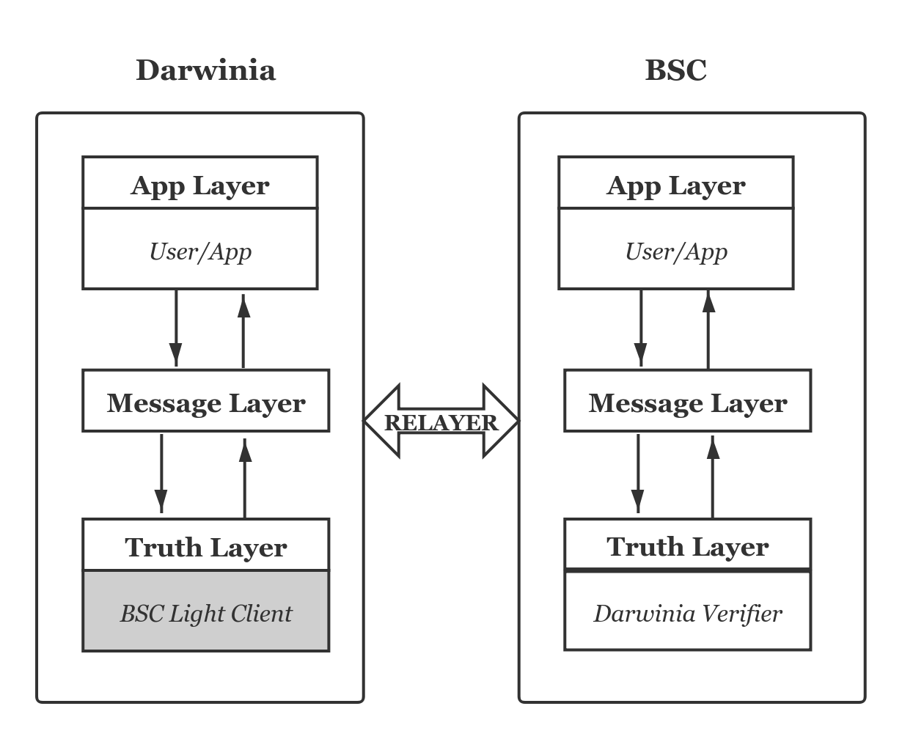
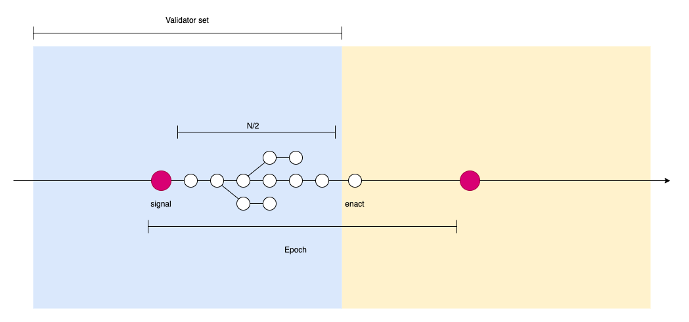
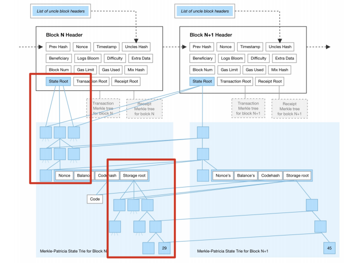

To build a cross-chain bridge between BSC and Darwinia, we need to deploy a BSC light client on the Darwinia side, which is responsible for the verification of relayed messages. It lies in the ***Truth Layer*** in the following hierarchy. In this article, we will introduce the design of our new BSC light client and discuss its implications for the Ethereum light client. 

# How the BSC Light Client Works

## What does a BSC Light Client Do?

In a light-client-based bridge, relayers transfer information between two blockchains, including block headers, messages, and proofs of messages. The light client's job is to verify the validity of messages using block headers and proofs of messages. Because cross-chain messages are stored onchain, the light client does not necessarily need the header of the block where the message is generated to do the verification. In other words, only headers of *epoch* blocks will suffice. The reason will be stated in the section of  **Message Proof**. Therefore, we explain the job of the BSC light client in two parts: verification of headers(of epoch blocks) and verification of messages. 

## Verification of Headers

### Update BSC Validator set

According to the [BSC consensus](https://docs.binance.org/smart-chain/guides/concepts/consensus.html), the consensus engine is named **Parlia**, which is similar to [Clique](https://ethereum-magicians.org/t/eip-225-clique-proof-of-authority-consensus-protocol/1853), where members of a validator set take turns to produce blocks. We need to ensure that the validator set in the light client can accurately follow the BSC.

### BSC light client security

For every epoch block, the new validator set will be filled in the *extra_data* field of the block header. But, for the security reason, the new validator set only takes effect after _**N/2**_ blocks. (_**N**_ is the size of the validator set in the last epoch block)

Since the light client can not verify it against the contract(there is no contract data in the light client), it has to believe the signer of the epoch block. If the signer of the epoch block write a wrong *extra_data*, the light client may just go to a wrong chain. 

If we delay _**N/2**_ blocks to let the validator set change take place, the wrong epoch block won't get another _**N/2**_ subsequent blocks signed by other validators, and therefore the light clients are free from such attacks.

### Validator set update process

From the above conclusions, once the light client receives an epoch block, it only needs to keep receiving its _**N/2**_ following child blocks, which is enough to update the validator set.

When a fork happens, you do not need to decide on which branch to use instantly. According to the criteria specified in the BSC documentation, once the number of child blocks on a branch reaches _**N/2**_, this branch will become the canonical one, as the following diagram shows.

Validator set change

1. When a validator node receives a new epoch block (_**height%epoch==0**_), it fetches the new validator set from it after verifying its signature;
2. It continues to receive the following blocks and verify the signatures with the current validator set. Once the length of the longest branch reaches _**N/2**_, the epoch block can be finalized;
3. The validator set is updated;
4. Go back to Step 1.

### Finalize the BSC block header

According to Darwinia's cross-chain bridge specification, cross-chain verification is the verification of messages or events on the source chain using the accepted  block headers. If the information in the light client is insufficient for the verification of messages or events, the light client needs extra information, which normally is the block header when the message or event happens.

## Verification of Messages

In our the design of the cross-chain message protocol, a message is nothing more than a key-value pair stored onchain. The process to verify a message is exactly the same as the verification of any storage. The light client needs the **message**, the **message proof** and the **State Root** hash in the block header to accomplish the verification task. The finality of block headers was discussed in the previous section. Here we will explain the the **messages** and the **message proof**.

### Message

A cross-chain message is stored as a key-value pair under the account of the smart contract of Message Protocol. The **key** part contains the indexing information(chain_id, lane_id etc.) of the message and the **value** part is the payload which contains the encoded information for the application on the target chain to interpret. 

### Message Proof

The message proof consists of two parts, the storage-trie-related ***storageProof*** and the state-trie-related ***accountProof***. The BSC light client first verifies the message with the first part of the proof(***storageProof***) against the ***storageHash***(***SHA3*** of the ***StorageRoot***), and then the second part(***accountProof***) against the ***stateRoot***, which is included in the finalized block header. 

Since a cross-chain message is stored on the source chain unless it is pruned after being successfully delivered, the message is included in the digests of several blocks. Therefore, the BSC light client does not necessarily need to have every block header from the BSC network to verify the messages. Even better, a header can often be used in the verification of multiple messages(with the respective multiple proof).

# Discussion

In our previous design, the light client on the Darwinia side utilized an **MMR**(**M**erkle **M**outain **R**ange)-proof-based verification mechanism. **MMR** is a variant of the Merkle tree, which is easy to add a new node to the existing tree. However, neither **Ethereum** nor **BSC** has inherent support for **MMR**, so we had to run an off-chain service to maintain an **MMR of Ethereum** or **BSC.**

The revision of the BSC light client is a step toward the unified model of different types of bridges. This new design has already been implemented in our Substrate-to-Substrate bridges. For BSC, it has separated the ***Truth Layer*** from the ***Message Layer*** by eliminating the **MMR** service. The side effect of the new design is the gas fee brought about the use of on-chain storage. It pays off for low-gas-fee blockchains, like BSC. For Ethereum, optimization to save transaction cost is an open question.