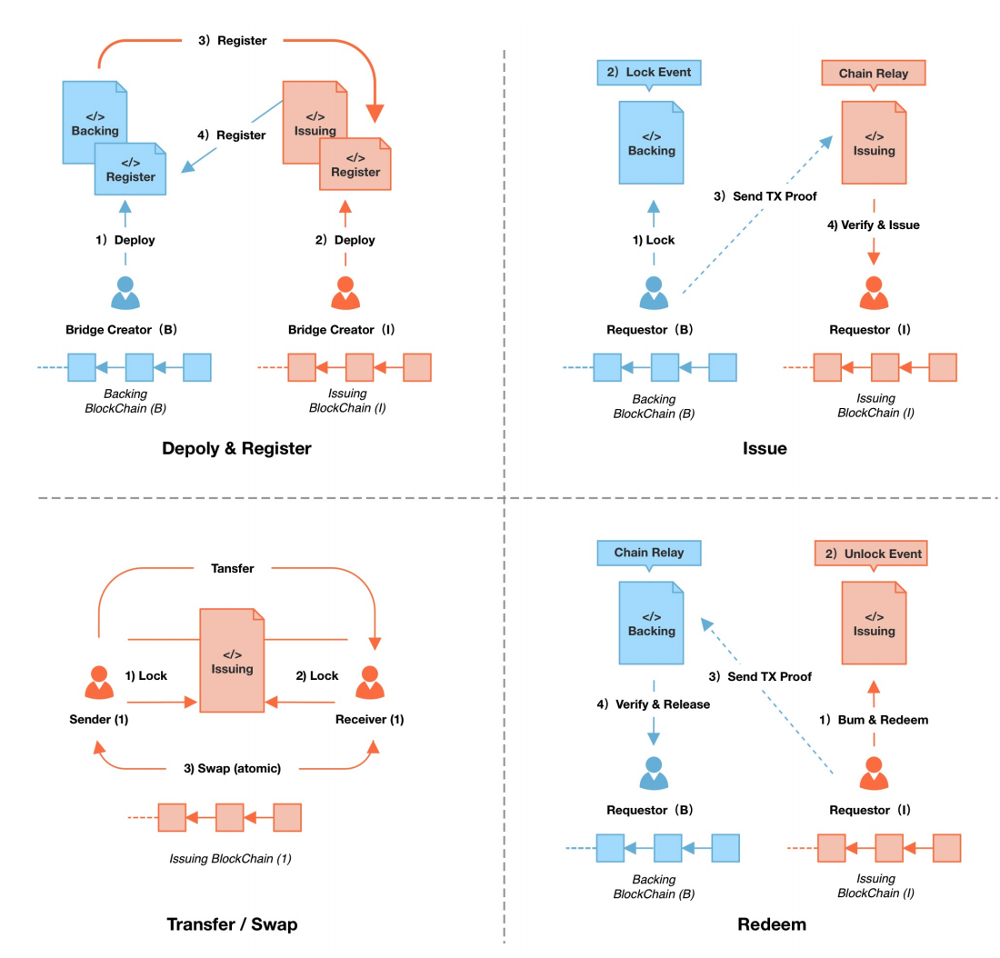
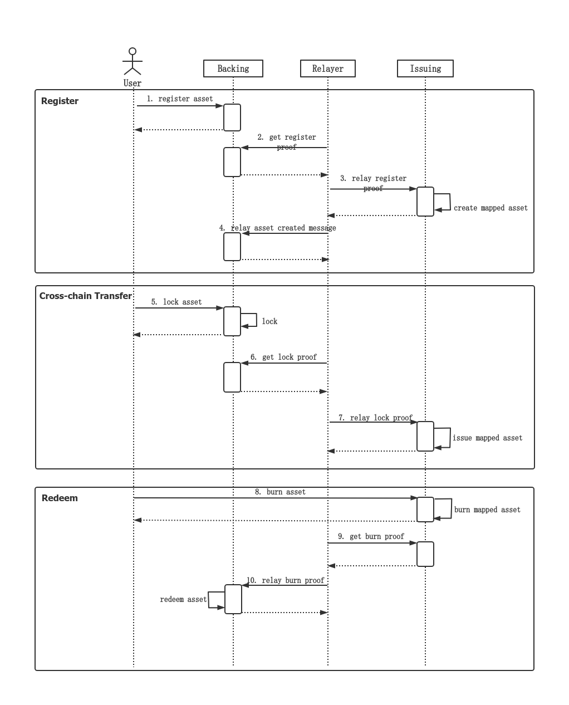

*The Darwinia cross-chain bridge is a generic bridge that allows third-party assets to use its cross-chain capabilities to be transferred between two blockchains. Before cross-chain transfers, third-party assets need to register with the Darwinia cross-chain bridge. This article describes how third-party can register assets and transfer funds using the Darwin cross-chain bridge and defines the interfaces involved in this process. In addition, it introduces how third-party assets are synchronized in the Darwin cross-chain bridges after upgrading.*

## Terminology

### Source and Target Chains

They refer to the source blockchain and the target blockchain for cross-chain asset transfer via a bridge respectively, or the caller and the callee of a remote chain call. Generally, a light client of the source chain needs to be built on the target chain to perform cross-chain validation of messages or events from the source chain.

### Native Assets vs. Mapped Assets

These two terms are a pair. A native asset is one that exists on its native chain, such as BTC on the Bitcoin network, as opposed to those that are wrapped or mapped, or that are transferred to other chains, such as wBTC. A native asset is typically an asset that has not been cross-chained, such as RING on Darwinia mainnet, while a mapped asset is one that is issued on another chain, such as ERC20-RING on the Ethereum network, by locking the native asset and with the locking proof in the CBA model.

### Relayer

A standalone application that provides the message relay service.

# CBA Model

CBA stands for Cryptocurrency Backed Asset. To build the CBA model, we need to build a ***Backing*** module on the source chain and an ***Issuing*** module on the target chain. Detailed explanations can be found in the relevant sections and [the technical paper](https://darwinia.network/Optimistic_Bridge_Technical_Paper(Preview)_EN.pdf).

- Backing Module
    
    The module that locks and unlocks the native assets on the source chain
    
- Issuing Module
    
    The module that issues and burns the mapped assets on the target chain
    

## Interfaces

### Backing Module (Source chain)

- ***register***(*asset_address*)
Parameter(s):
    - *asset_address*: Address of the native asset
- ***lock_and_remote_issue***(*asset_address, recipient, asset_option*)
    
    Parameter(s):
    
    - *asset_address*: Address of the native asset
    - *recipient*: The address of the recipient on the target chain
    - *asset_option*: Attributes of the asset

## Issuing Module (Target chain)

- ***burn_and_remote_unlock***(*asset_address, recipient, asset_option*)
    
    Parameter(s):
    
    - *asset_address*: Address of the native asset
    - *recipient*: The address of the recipient on the target chain
    - *asset_option*: Attributes of the asset

## Cross-chain Protocols

Following are the sequence diagrams of cross-chain protocols:

### Cross-chain Transfer of Assets

A cross-chain transfer is the process in which native tokens are locked as backing assets on the source chain, and the mapped tokens are issued in the target chain. After the asset registration, assets can be transferred between two blockchains via a Darwinia cross-chain bridge. 

During a cross-chain transfer, users lock a specific amount of native assets and assign a receiving account on the target chain by calling the *lock_and_remote_issue()* interface of the ***Backing*** module. They can get proof of locking from the source chain when succeeding. Then the relayer (a standalone application connecting two blockchains) forwards the proof to the ***Issuing*** module on the target chain. In the end, the Issuing module writes the calculated amount of mapped tokens to the receiving account after verifying the proof.

### Cross-chain Redemption of Assets

A cross-chain redemption is the inverse of a cross-chain transfer which refers to the process in which the locked assets are unlocked on the source chain after the mapped assets are burnt on the target chain. Burning the mapped assets and presenting the proof is the only way to unlock the locked assets.

During a cross-chain redemption, asset holders call the *remote_unlock*() interface in the ***Issuing*** module to burn an amount of mapped tokens on the target chain and assign a receiving account on the source chain. Then the relayer delivers the proof of burning to the ***Backing*** module on the source chain. In the end, the ***Backing*** module releases the locked assets to the assigned receiving account after verifying the proof.

### Constraints on Messages

- Must be Delivered
    
    The messages generated on the source chain must be delivered to the target chain as long as they are legitimate.
    
- Must be verifiable
    
    Legitimate messages can be verified between the Backing and Issuing modules, while illegitimate ones can be identified and blocked.
    
### Cross-chain Fees

- **Who Pays**
    
    Those who launches the operation (registration, cross-chain transfer, cross-chain redemption etc.) pays the cross-chain fees.
    
- **In What Tokens**
    
    Cross-chain fees are paid in the on-chain assets of the originating blockchain of the cross-chain operation. 
    
## Mapping Token Factory

Every bridge has a sub-module called ***Mapping Token Factory*** in the ***Issuing*** module. Its responsibilities include *creating*, *issuing* and *burning* mapping assets. Bridges to different target blockchains can share a singleton of ***Mapping Token Factory*** to manage different types of mapping tokens.

### Standards of Mapping Assets

Before the creation of mapping assets, the ***Mapping Token Factory*** has defined a set of criteria for creating a mapping asset, the properties and methods of which are aligned as closely as possible to the native asset but are allowed to differ. The bridge can choose which criteria to use when creating a mapping relationship, but only one criterion is allowed for a native asset, meaning that the mapping asset and the native asset are in a one-to-one relationship. The standards are open for future upgrade. In addition, the mapping asset keeps the ***native*** property of the native asset.

### Permission Management

The ***Issuing*** module system account manages the creation, issuance and redemption of mapped assets. The system account's permission to operate is derived from the asset backing and burning proofs.

## Proposals of Routing Functionality

Assuming one wants to transfer assets from *Chain A* to *Chain B* and eventually to *Chain C*, we have two proposals to accomplish the task.

### Proposal A

For the assets that are not issued on the target *Chain C*

- Build a bridge from *Chain A* to *Chain B* and register the native assets to the bridge to generate the corresponding mapped assets on *Chain B*,
- Then build a bridge from *Chain B* to *Chain C* and register the mapped assets obtained in the first step to the bridge, resulting in a secondary mapped asset on *Chain C*,
- Users can first lock the ***native*** asset in *Chain A*, get the ***mapped*** asset issued on *Chain B*, and similarly lock that ***mapped*** asset as the ***secondary native*** asset of the B ⇒ C bridge to get the mapped asset issued on *Chain C*. It involves two steps of operation from users.
- An optimization is to start a ***Routing*** module on *Chain B*. Users specify the transfer path when initiating a transfer in *Chain A*. After the ***mapped*** asset is issued on *Chain B*, the second locking operation is automatically performed by the ***Routing*** module of *Chain B*.

### Proposal B

For assets that are issued both on the *Chain A* and *Chain C*, (Darwinia can assume the role of *Chain B*)

- Create a bridge from *Chain A* to *Chain B*, mapping the native assets of *Chain A* to *Chain B*,
- Create a bridge from *Chain C* to *Chain B*, mapping the native assets of *Chain C* to *Chain B*,
- Now we have two types of native assets from *Chain A* and *Chain C* on *Chain B*, which are equivalent in value, such as USDT on the Ethereum network and USDT on the BSC network,
- Use the liquidity pool on *Chain B* to create an liquidity pool for these two types of assets,
- Users transfer native assets from *Chain A* to *Chain B* as mapped assets, exchanges them in the liquidity pool for their counterpart backed by native assets on *Chain C*, and then redeem them back to *Chain C* via the C⇒B bridge.