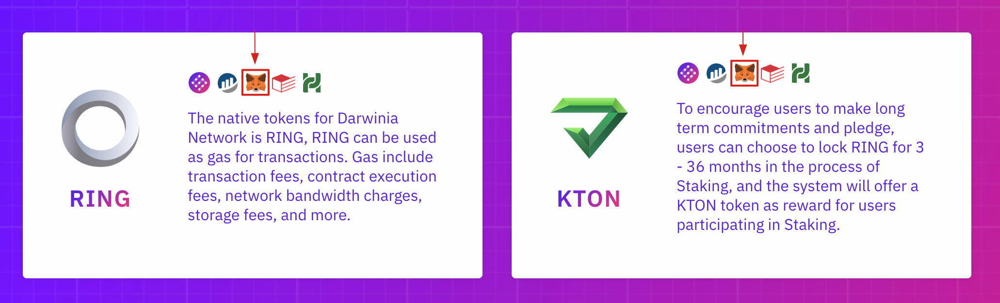
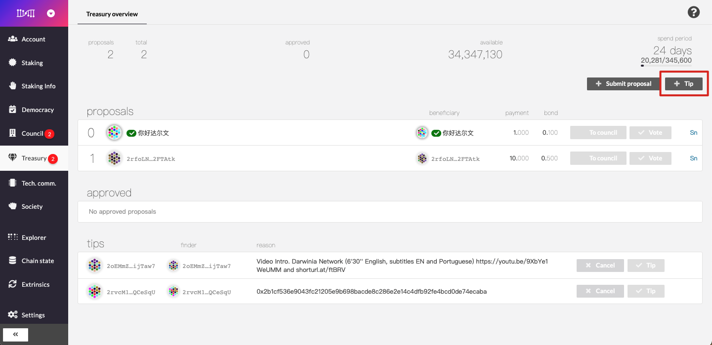

To help the community get to know the Darwinia ecosystem quickly, we have broken it down into the six sections below: General, Token-related, Staking-related, Nominator and Validator,  and Governance-related where you will find answers to the most frequently asked questions. Thanks for reading!

# General

## **What is the history of the Darwinia Network?**

The Darwinia Network project started in late 2018 when Parity released the Substrate toolkit project. Darwinia implements a decentralized network that acts as a relayer chain between major blockchains and enables asset transfers in a decentralized and permissionless non-custodial way.

- Darwinia was designed to operate as a parachain of Polkadot but can also work in Solo mode as an independent network with its own consensus, security, and cross-chain functionalities which can be adopted for backup and mitigation of Polkadot-based technical issues.
- Darwinia team has developed an Application SDK based on Polkadot’s Substrate and Darwinia Web applications in order to facilitate the development of different applications running on Darwinia Network.
- We’ve also developed a leading blockchain explorer [Subscan](https://www.subscan.io/) for Polkadot and Substrate Community.

Before launching Darwinia, the team also developed several other products including the blockchain-based game [Evolution Land](https://www.evolution.land/), [Itering ID](https://id.itering.com/), Itering DKMS Solution, NFT shifter, etc.

- **Subscan**: A high-precision blockchain data explorer and visualization tool for Substrate-based blockchains.
- **Evolution Land**: The first Defi+NFT cross-chain game with each continent built on different blockchain networks.
- **Itering ID**: A set of air-gapped signing tools, capable of transferring by scanning QR-coded transactions.
- **DKMS**: A Decentralized Key Management System.
- **NFT shifter**: An easy-to-use tool to create and deploy blockchain NFT assets.

## **What is the latest roadmap？**

Please check out the latest roadmap [here](https://www.notion.so/9617e154ec884b07a7cee9a056374e42).

## **What is the relationship between Darwinia Network and Polkadot?**

Darwinia Network is the first game chain designed to connect to Polkadot. The development of Darwinia network is based on Polkadot and Substrate framework. Darwinia network will act as a parachain of the Polkadot network in the near future. Even if Darwinia Network is voted off the Polkadot parachain set, it still can work as a "Solo Chain" with its own consensus and security infrastructure.

## **Is the Darwinia network only used for blockchain games?**

Darwinia Network was originally designed to be the low-level cross-chain solution for Evolution Land, but evolved into an independent decentralized cross-chain infrastructure which now benefits the whole crypto industry. Dapps from gaming, NFT to Defi, Stablecoin can all leverage Darwinia Network's bridge chain to upgrade themselves from single chain application to a multi-chain/cross-chain version.

# **Token-related**

## **Why can I not find RING/KTON within Metamask?**

You need to add RING/KTON to Metamask as a custom token. Please visit the Website homepage to click the corresponding icon.

## RING Specification

- Ethereum
    - Spec: `ERC20`
    - Precision: `18`
    - Smart Contract Address (Ethereum): `0x9469d013805bffb7d3debe5e7839237e535ec483`
- Tron
    - Spec: `TRC20`
    - Precision: `18`
    - Smart Contract Address (Tron): `TL175uyihLqQD656aFx3uhHYe1tyGkmXaW`
- Darwinia Network
    - Spec: Native
    - Precision: 9
    - Smart Contract Address: n/a
- Heco
    - Spec: `HRC20`
    - Precision: `18`
    - Smart Contract Address(Heco): `0x15e65456310ecb216B51EfBd8a1dBf753353DcF9`
- Polygon
    - Spec: `ERC20`
    - Precision: `18`
    - Smart Contract Address(Polygon): `0x9C1C23E60B72Bc88a043bf64aFdb16A02540Ae8f`

## KTON Specification

- Ethereum
    - Spec: `ERC20`
    - Precision: `18`
    - Smart Contract Address (Ethereum): `0x9f284e1337a815fe77d2ff4ae46544645b20c5ff`
- Tron
    - Spec: `TRC20`
    - Precision: `18`
    - Smart Contract Address (Tron): `TW3kTpVtYYQ5Ka1awZvLb9Yy6ZTDEC93dC`
- Darwinia Network
    - Spec: Native
    - Precision: 9
    - Smart Contract Address: n/a

## Where can I check out the circulating supply and total supply of RING/KTON?

1. Check out it on our [website](https://darwinia.network/economic_model)
2. Check out the API link directly:
- [RING](https://api.darwinia.network/supply/ring)
- [KTON](https://api.darwinia.network/supply/kton)

## **Where can I trade RING and KTON?**

You can check out [coinmarketcap](https://coinmarketcap.com/currencies/darwinia-network/markets/) for related trade information. 

# Staking-related

## **What is the ROI of participating staking?**

In terms of the staking ROI, feel free to make a copy of the file and try out the parameters. You can click [here](https://docs.google.com/spreadsheets/d/1oIC4xC2mwIBa0pZDj4lw57NbiVvcDQNH_K3KtCUFVnc/edit#gid=0). 

## **How to stake RING/KTON?**

Kindly follow up on these steps ：

1. Create an account on Darwinia Network.

Go to [Apps](https://apps.darwinia.network/) and create an account on Darwinia. (Do not forget to switch to Darwinia Network. Crab is the canary network of Darwinia. Left upper corner of the Apps, click and switch it.)

2. Swap ERC20 RING and KTON to Darwinia Network.

Transfer your RING or KTON or both to your ERC20 personal wallet (MetaMask or Trust Wallet) if they are in any exchange. Then go to the [Wormhole](https://wormhole.darwinia.network/) to transfer assets from Ethereum to Darwinia Network. Make sure to have 10 RING per transaction in MetaMask as well as a little ETH to pay the transfer fee. The transaction usually takes around 30 minutes to fully process. However, you can trace your transaction.

For detailed tutorials on transfers, please refer to [here](https://docs.darwinia.network/docs/en/quick-start-crosschain-transfer-e2d)!

3. Bond your RING/KTON in Darwinia Apps.

Once you receive your assets in Darwinia Network you need to bond them (leave a tiny bit out for a fee, at least 5 RING). You may bond and lock your RING from 1 month to 36 months (here one month means 30 days) and accordingly, you will be awarded KTON token upfront (you may stake awarded KTON as well). Now you can see your power (power fluctuates frequently).

4. Nominate a validator

Now you need to nominate at least one validator, and it is recommended to nominate more than one validator that is online on the staking info tab and earning points. Please note that a green check means the validator has undergone identity verification and is not an indication of online/offline status. After completing this step you have successfully staked your tokens.

For detailed tutorials on nominator/validator, please read the detailed tutorial [here](https://docs.darwinia.network/docs/en/wiki-tut-nominator)!

5. Claim your rewards

On the next era (see staking info tab to know when will next era begins) your assets are properly staked and you may see that your power is assigned to the nominated validator(s) and after one more era (24h more) you will see your first reward (RING), you may claim them if those are not already claimed. 

## **What is the Power?**

Users participate in staking, and the rights and interests obtained by bonding RING or KTON are called Power.

## **How to get Power and how to calculate the amount of Power?**

Bonding RING or KTON will give Power, where the bonded RING total amount and KTON total amount respectively correspond to 1/2 of Power total amount.

- Total Power = 1 (Decimals: 10^9)
- Power obtained by bonded RING = number of bonded RING / current total number of bonded RING * (total power / 2)
- Power obtained by bonded KTON = number of bonded KTON / current total number of bonded KTON * (total number of Power / 2)

## **What is the Power share?**

Power share is the percentage of Power held of total Power. The greater the Power share, the greater the influence of the decision made on the entire network.

- Power share = Power held / Total Power * 100%

## **Why does my power share increase or reduce?**

The change of Power share depends on two factors:

- Changes in the number of self-bonded assets
- Changes in the number of current network total bonded assets

Therefore, if you find that your Power share has changed without any operation or change in self-bonded assets, it is normal and may be caused by a change in the total number of bonded assets on the network.

## **How long do I need to wait for unstaking/withdrawing my tokens?**

It takes 14 days to unbond tokens from staking.

# Nominator and Validator related

## How to become a nominator/validator？

For detailed tutorials on nominator/validator, please read the detailed tutorial [here](https://docs.darwinia.network/docs/en/wiki-tut-nominator)!

# Governance-related

## How to apply for "Tip" on treasury?

If you have contributed to the community before, you can also apply for Tip in the treasury column [here](https://apps.darwinia.network/#/treasury).

Please check out the tutorial below:

Write down what you have done, and cover with blog/post/image/video links.

Then, please wait patiently, the council member will evaluate and vote for your tips.

