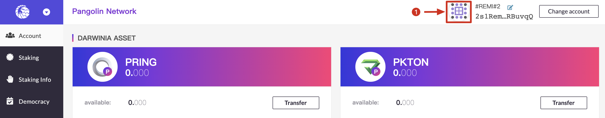
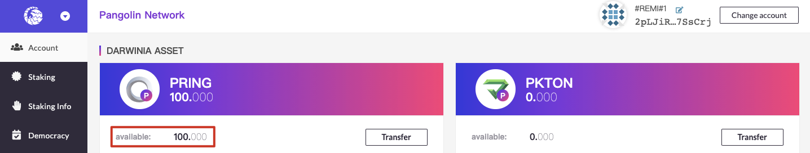

>Pangolin is the test network of Darwinia and Crab network. PRINGs are test tokens and have no intrinsic value.

## Features

- Test the latest technology;
- Compatible with Ethereum Virtual Machine;
- Compatible with Ethereum contract infrastructure Metamask, Remix, etc.;
- Support for smart contracts in Solidity;
- May be reset.

Developers can join the Telegram community named "[Darwinia Faucet Official](https://t.me/darwiniafaucet_official)" to get PRINGs for testing. Please refer to the following for detailed application procedures.

## Faucet

- Visit [Darwinia Apps Portal](https://apps.darwinia.network/#/account) and select the "Pangolin Test Network" in the network list in the upper left corner.

- Create an account on Pangolin Test Network. For detailed tutorials on creating an account, please refer to [here](https://docs.darwinia.network/en/quick-start-account)!
- Click the avatar and you can copy your Pangolin address.

- Join the Telegram group named "[Darwinia Faucet Official](https://t.me/darwiniafaucet_official)".
- Send `/faucet`+ Pangolin address.

- You can open the link of the darwinia_bot to check the transaction on Subscan.

- When the transaction is successful, a certain number of test tokens will appear in your pangolin address.

- Each telegram account can get 100 PRINGs every seven days.