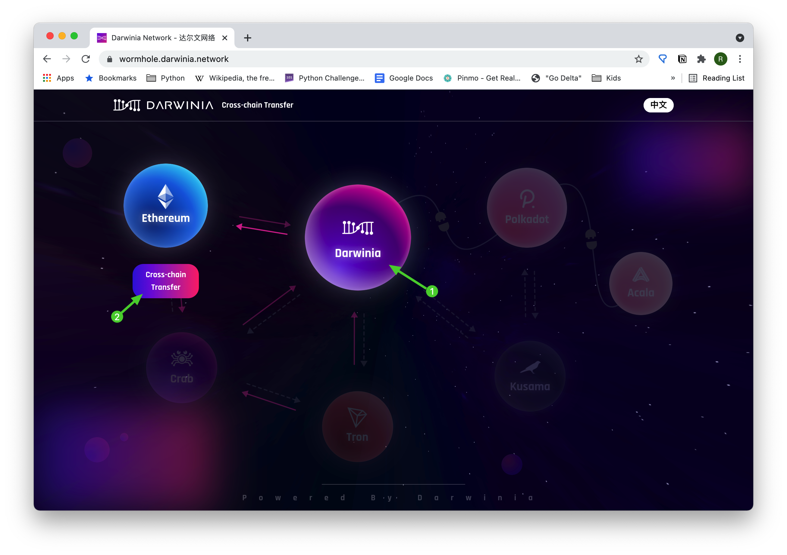
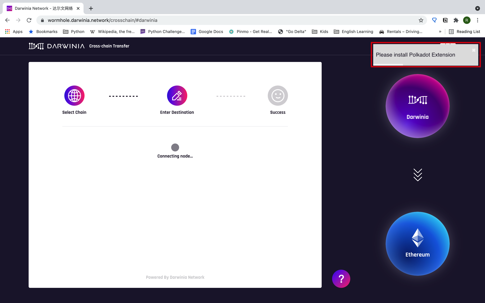
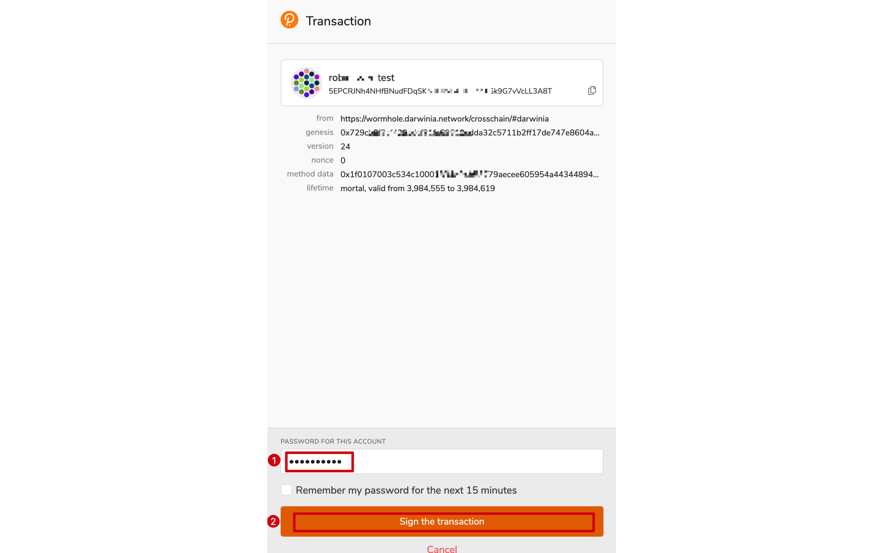
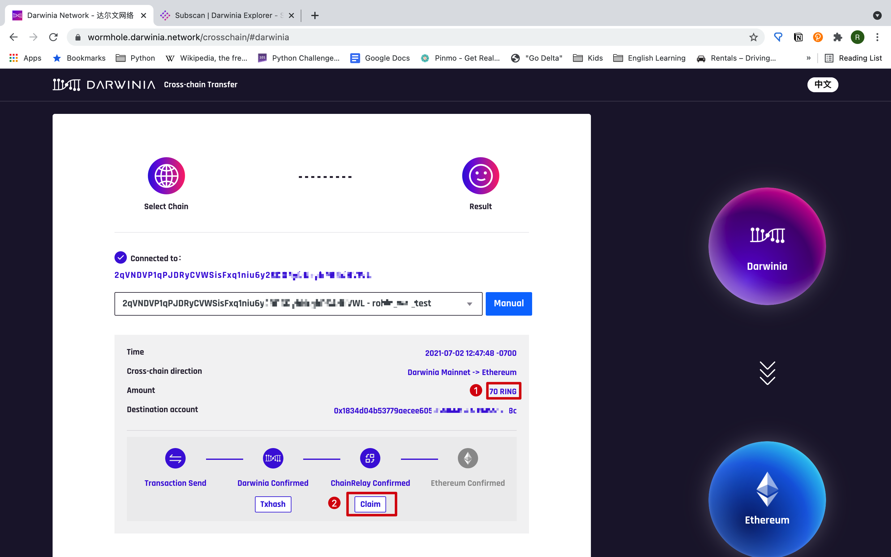
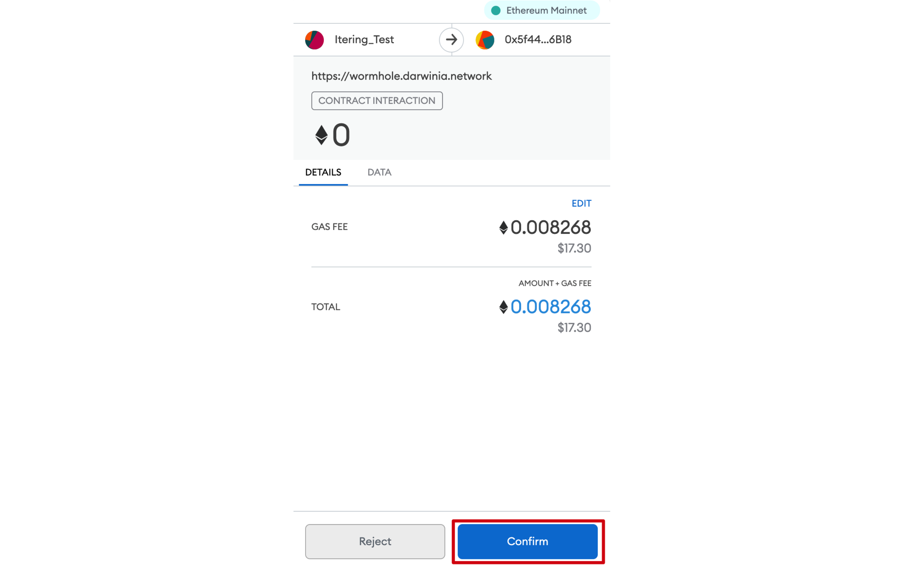
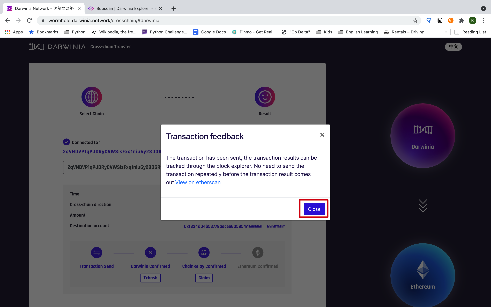
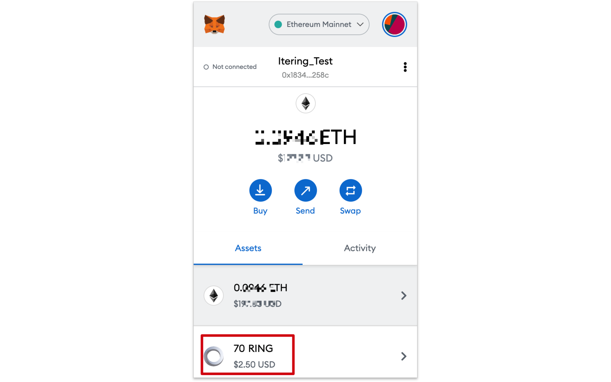
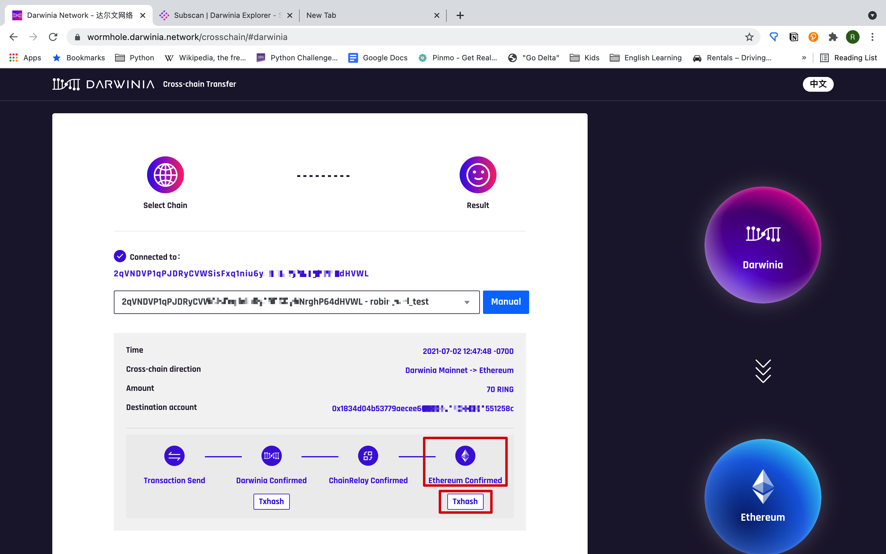
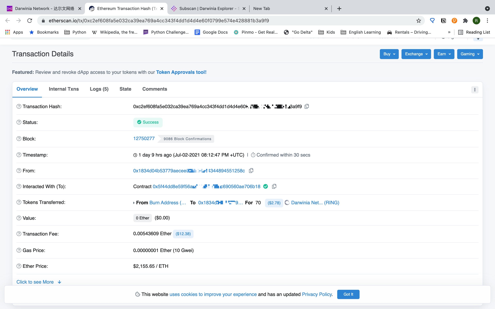

## Intro

If you want to monetize your gains on Darwinia network, you need to transfer them to a Ethereum wallet first. Then you can deposit them into an exchange account and trade them. In this article, we will show you how to transfer tokens from Darwinia to Ethereum step by step.

A Darwinina-to-Ethereum transfer can be divided into two phases:
1. Lock the tokens(RING/KTON) on Darwinia Network
2. Claim the tokens(RING/KTON) on Ethereum

## Prerequisites
In order to proceed with the following operation, you need to meet these prerequisites.

- The browser extension [*Polkadot.js*](./quick-start-account.md) is installed and correctly configured. 
- The Ethereum wallet [*MetaMask*](https://chrome.google.com/webstore/detail/metamask/nkbihfbeogaeaoehlefnkodbefgpgknn) is installed and correclty configured. 
- You have enough ETH nd Rings on your account to cover the transaction fee and gas fee.

## Steps

Before you start, you need to have your Ethereum account(address) prepared. This address can be found on the top-right part of the window when you click the Menubar icon of MetaMask. It can be copied to the clipboard by clicking the account name.

### Phase I -- Lock the Tokens

First visit [Darwinia Wormhole](https://wormhole.darwinia.network/) and choose **Darwinia**, then click *"Cross-chain Transfer"** below the **Ethereum** bubble.

Click "*Cross-chain Transfer*" after confirming the right network is selected.

If you have not installed [*Polkadot.js*](./quick-start-account.md), a pop-up window will appear as follows.

The first time you use *Polkadot.js* on Darwinia network, it requires your authorization to proceed.

Then input the password to the *Polkadot.js* account you want to use and click "Sign the transaction".

Copy and paste the target Ethereum address, input the amount of tokens you want to transfer, and click "*Submit*".

After submitting, you can check your transaction by clicking "*Cross-chain History*".

At this point, you have completed the first phase of the transfer.

### Phase II -- Claim the Tokens

In order to claim the tokens, you need to enter "*Cross-chain History*" page.

Check the amount you are about to claim and click "*Claim*".

A MetaMask window will pop up. Enter your password if required. The gas fee is displayed. Click "*Confirm*" to proceed.

Close the pop-up window and you will see the tokens are transferred to your wallet.

You can check the details of the transaction by clicking "TxHash".

