## Intro

You can transfer your tokens on your Ethereum account to the Darwinia mainnet and use them for staking to take advantage of the current high ROE. We will show you how to perform Ethereum-to-Darwinia transfer step by step in this article.

## Prerequisites

In order to proceed with the following operation, you need to meet these prerequisites.
- The browser extension [*Polkadot.js*](./quick-start-account.md) is installed and correctly configured. 
- The Ethereum wallet [*MetaMask*](https://chrome.google.com/webstore/detail/metamask/nkbihfbeogaeaoehlefnkodbefgpgknn) is installed and correclty configured. 
- You have enough ETH and Rings on your account to cover the transaction fee and gas fee.

## Steps

Before you start, you need to have your Darwinia account(address) prepared. This address starts with "2" and can be found on the top right part of the window when you log into [Darwinia Apps Portal](https://apps.darwinia.network/). It can be copied to the clipboard by clicking the account icon.

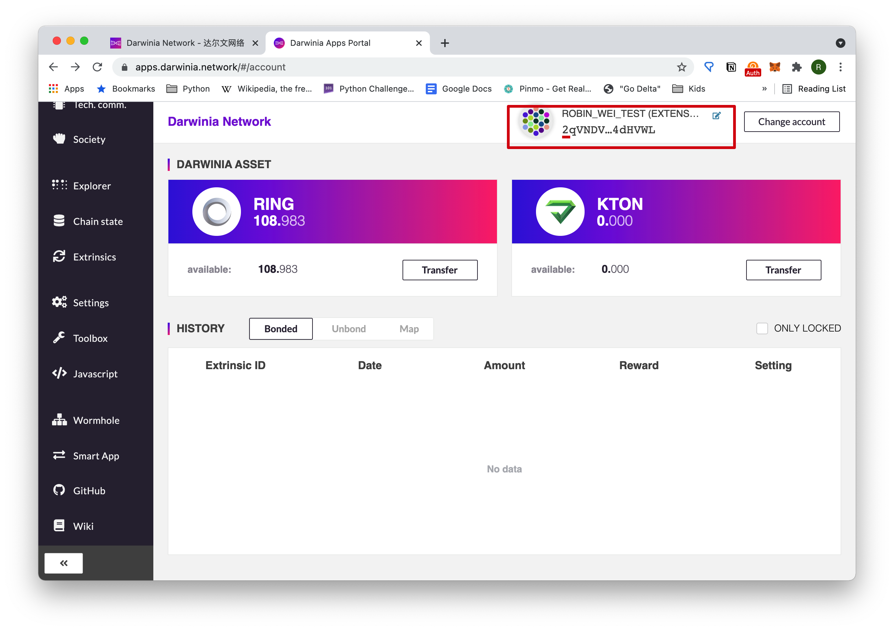

First visit [Darwinia Wormhole](https://wormhole.darwinia.network/) and choose **Ethereum**, then click the *"Cross-chain Transfer"* button below the **Darwinia** bubble.

Click "*Cross-chain Transfer*" after confirming the right network is selected,
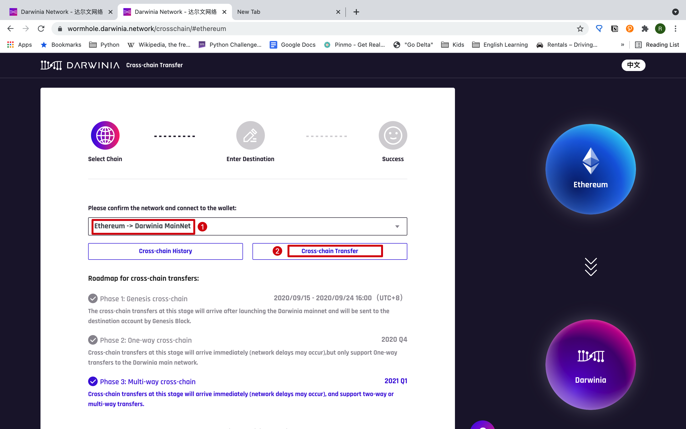
 
then copy and paste the Darwinia Network account(*address*) here which starts with a "*2*".
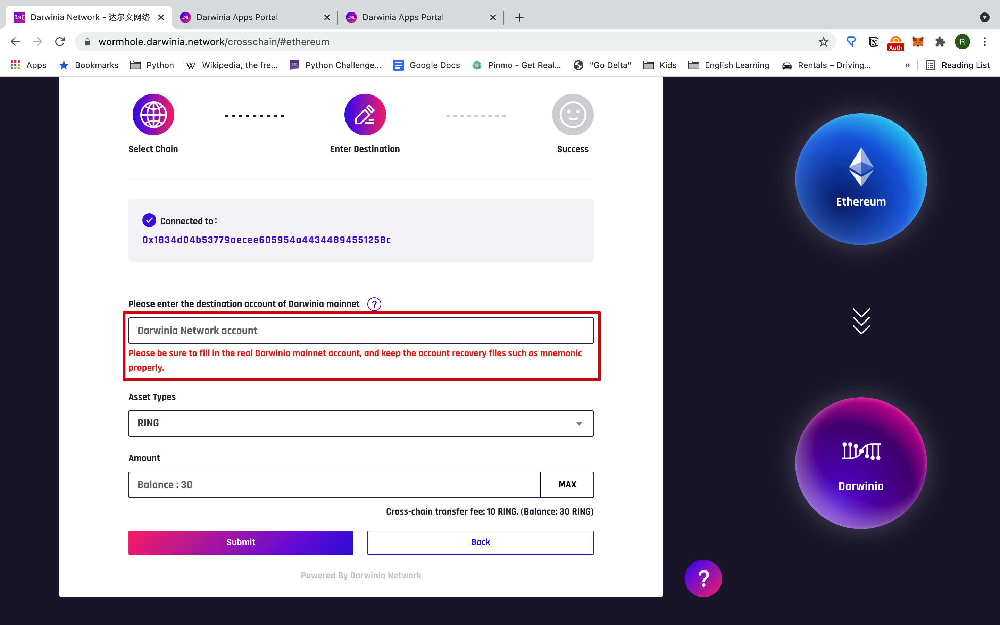

Now you can input the amount of rings you want to transfer and click "*Approve*".

Then you will be prompted to choose the Ethereum account from which you want to transfer. Make sure there is enough Ether to pay the gas fee, click "*Next*",
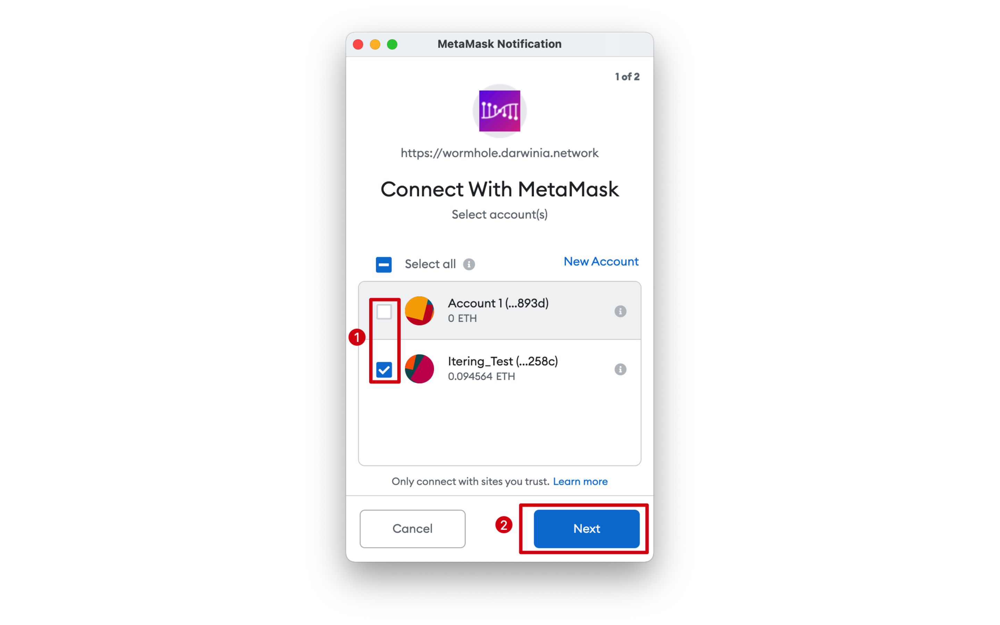

and then "*Connect*",
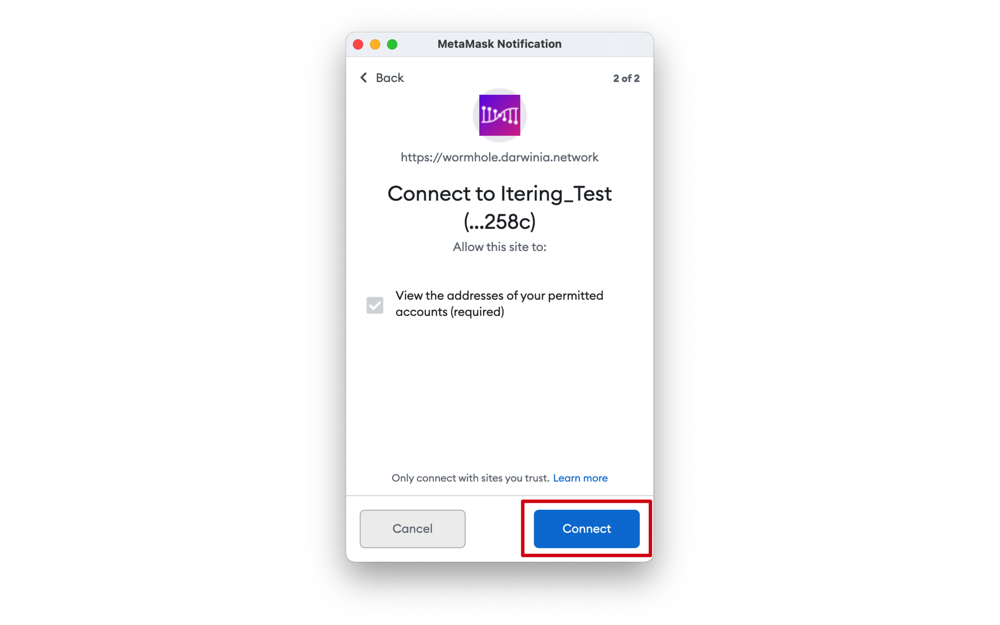

and "*Confirm*". Here you can see the transaction fee in ETH and estimated value in fiat currency.
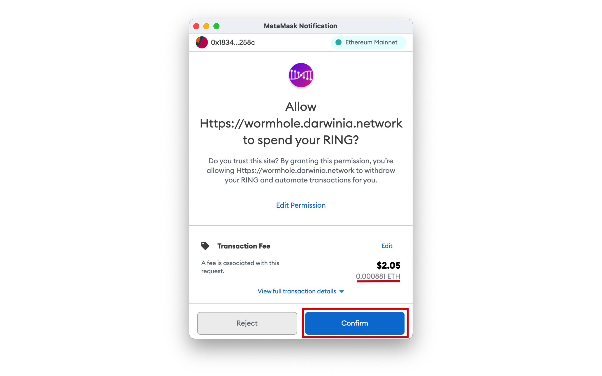

Then you can click "*Submit*" to submit the transfer.
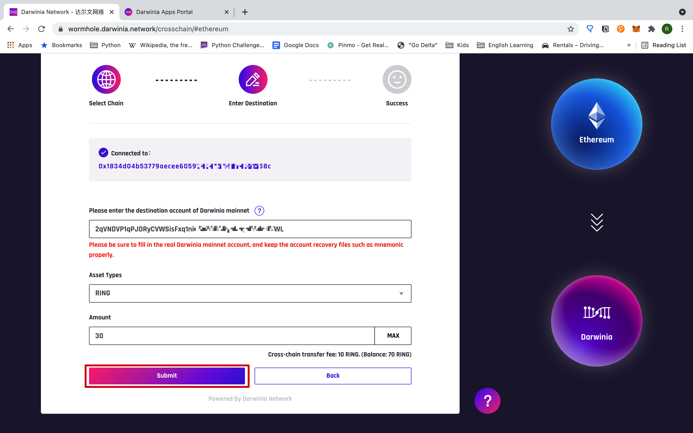

The last step is confirmation. Here you can see the gas fee in ETH and estimated value in fiat currency.
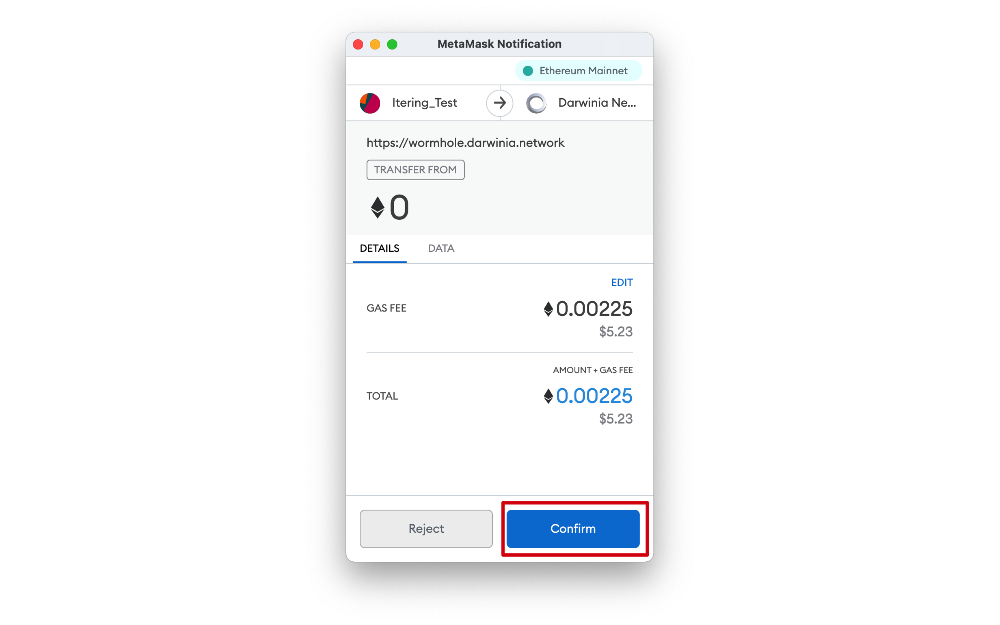

Now you have successfully submitted an Ethereum-to-Darwinia transfer. The transaction needs to be confirmed by Ethereum, ChainRelay and Darwinia network. You can check your transaction by clicking "*Cross-chain History*".
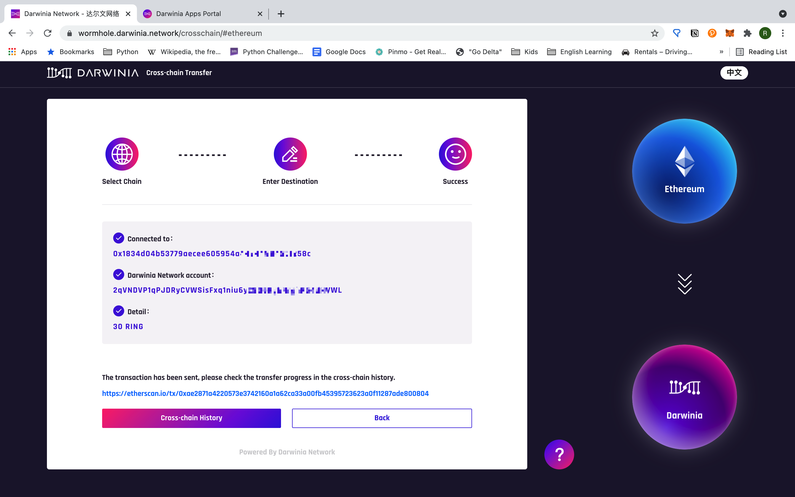

You can see your transfer is confirmed on Ethereum and waiting to be confirmed by ChainRelay and Darwinia network.
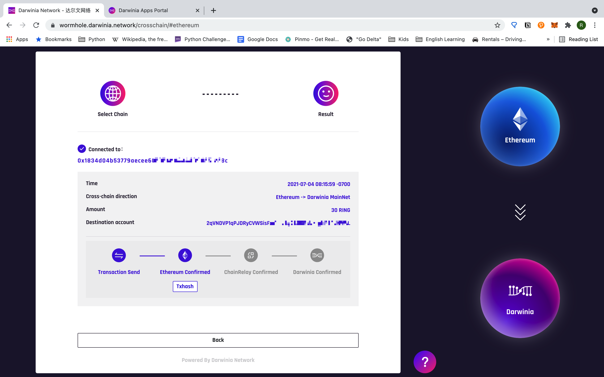

Refresh the page in a couple of minutes, and you can see your transfer is confirmed. Congratulations!
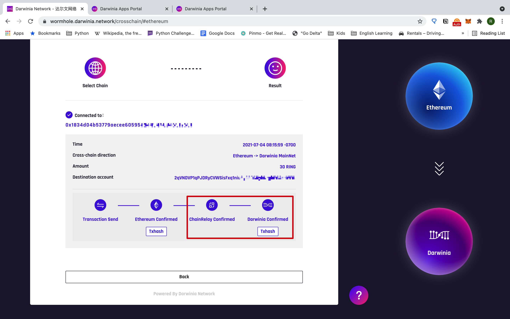

## Withdraw from a Centralized Exchange

If you purchase rings from a centralized exchange, you need to withdraw them from your exchange account to your MetaMask Ethereum wallet before transferring them to your Darwinia account.

There are a variety of exchanges that support rings transaction. Steps may vary from exchange to exchange. You should resort to their documentation to find out how to withdraw. But ensure to select the ERC20 chain; otherwise, you may suffer the loss of your assets.
