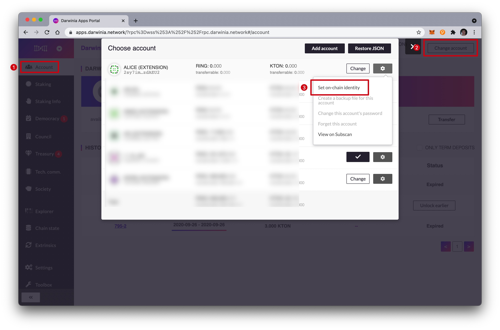
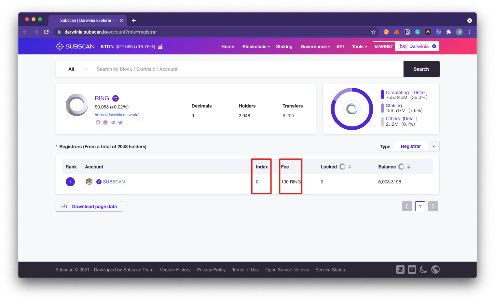

Darwinia provides a naming system that allows participants to add personal information to their on-chain account and subsequently ask for verification of this information by registrars.

## Setting an Identity

1. The easiest way to add the built-in fields is to click the gear icon next to your account and select `Set on-chain identity`.

2. Fill in the informations, and click `Set Identity`.

> Each field can store up to 32 bytes of information, so the data must be less than that. A [UTF8 to bytes converter](https://onlineutf8tools.com/convert-utf8-to-bytes) can help. To add custom fields beyond the default ones, please refer to [polkadot's learn-identity](https://wiki.polkadot.network/docs/learn-identity).

## Apply for Verification

1. After click `set identity`, you need to apply for verification. Click `Extrinsics` and set the corresponding value. The value of `reg_dex` and `max_fee` will change with different registrars.

2. You can use [Subscan](https://darwinia.subscan.io/account?role=registrar) to view the list of Darwinia Network registrars and get the value of `reg_dex` and `max_fee`. Up to now, Subscan is the only registrar of Darwinia Network.

3. After confirming that the transaction is sent successfully, please contact the registrar through the identity information left by the registrar to complete the verification. Each registrar may have different verification rules. Please contact the verifier for specific rules. To find out how to contact the registrar after the application for judgment or to learn who they are, we can click the account to see its detail.

## Contact the Registrar to Complete Verification

### Registrars

The job of an identity registrar is to provide judgments on users' requests and give different identity levels based on their information. 

Registrars can set a fee for their services and limit their attestation to certain fields. For example, a registrar could charge 10 RINGs to verify one's legal name, email, and GPG key. When a user requests judgment, they will pay this fee to the registrar who provides the judgment on those claims. Users set a maximum fee they are willing to pay and only registrars below this amount would provide judgment.

### Judgments

After a user injects their information on the chain, they can request judgment from a registrar. Users declare a maximum fee that they are willing to pay for judgment, and registrars whose fee is below that amount can provide a judgment.

When a registrar provides judgment, they can select up to six levels of confidence in their attestation:

- Unknown: The default value, no judgment made yet.
- Reasonable: The data appears reasonable, but no in-depth checks (e.g. formal KYC process) were performed. (2 or more social media identities have been certified)
- Known Good: The registrar has certified that the information is correct. (3 or more social media identities have been certified. And meet offline)
- Out of Date: The information used to be good, but is now out of date.
- Low Quality: The information is low quality or imprecise, but can be fixed with an update.
- Erroneous: The information is erroneous and may indicate malicious intent.

### Validation Rules for #0 Registrar "Subscan"

1. Contact the registrar to obtain specific rules for identity authentication.

2. Get verification code through social networks. Subscan will send a verification code to your email, Twitter, and riot (element) using the identity information you leave.

3. Paste the verification code and sign in the sign message. Go to [Sign message](https://apps.darwinia.network/?rpc%3Dwss%253A%252F%252Frpc.darwinia.network#/toolbox/sign), sign your received verification code. 

4. You will get the signature like this:

5. Reply the signature to the social media where you received the verification code. Wait for the Registrar to verify and grant the identity level.

### Completed Verification

Once the registrar has confirmed the identity, a green checkmark should appear next to your account name with the appropriate confidence level:

> Note that changing even a single field's value after you've been verified will un-verify your account and you will need to start the judgment process anew. However, you can still change fields while the judgment is going on - it's up to the registrar to keep an eye on the changes.