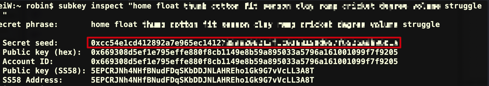
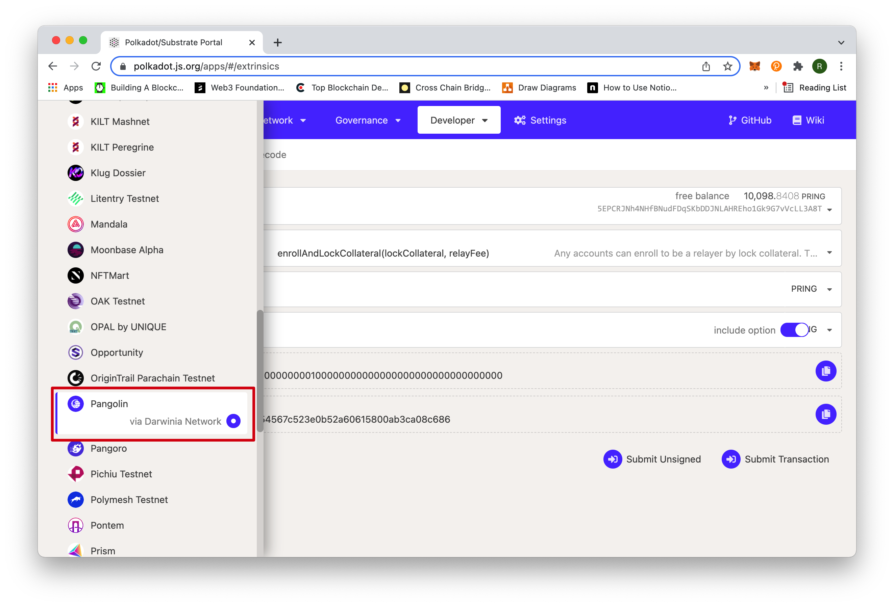
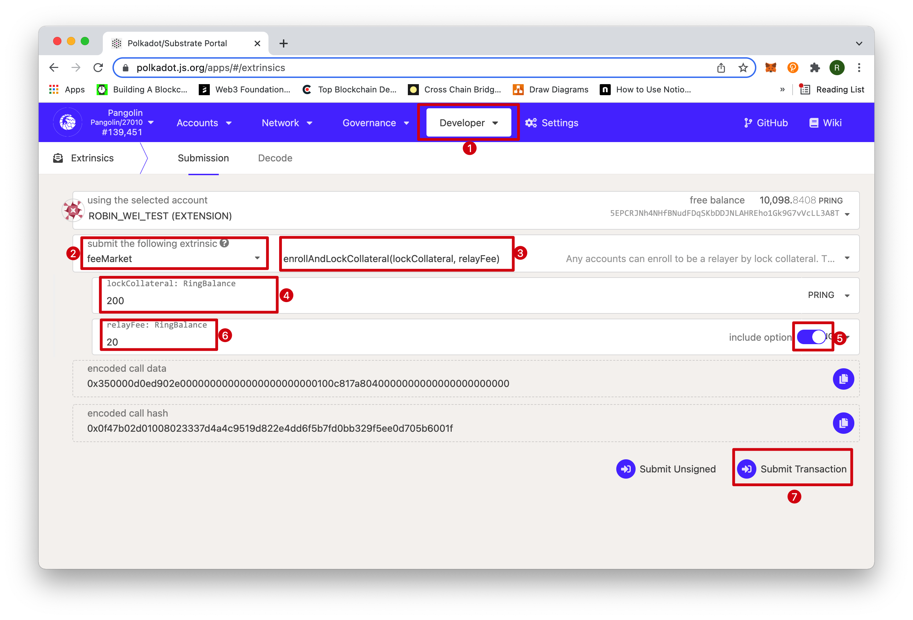
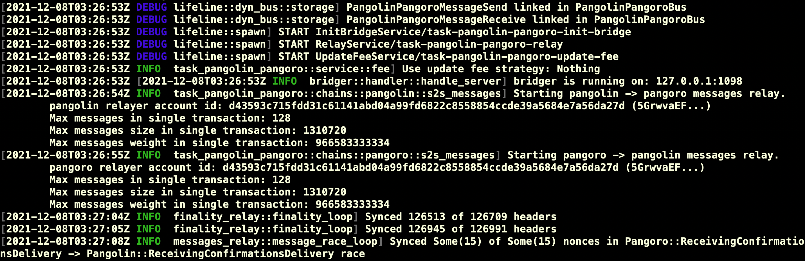

Relayers (aka. ***Bridger***s) in Darwinia Network are offchain worker clients which relay the headers and messages between the source chain and the target chain. They have access to both chains and transfer data in two directions. [Darwinia Bridger](https://github.com/darwinia-network/bridger/releases/) is an implementation of the relayer client written in Rust. Following are the steps of installation and configuration on a Substrate-to-Substrate bridger.

> **DISCLAIMER**: There is a possibility that you lose your assets due to many factors. Do your research and participate at your own risk. We strongly advise you to test-run on the Pangolin-Pangoro test bridge before going to the mainnet bridge.
> 

## Prerequisites

There are some skill requirements for running a bridger node. If you are Darwinia/Crab validator, you've already had the skill set. You can use the following checklist as a reference.

- [ ]  Basic Linux/Unix commands
- [ ]  Basic Docker operation
- [ ]  Concepts of private keys, public keys and accounts in blockchains
- [ ]  Able to sign and submit an extrinsic on Substrate-based blockchains

## Overview

To successfully run a bridger node, you will go through many steps. We present a big picture here with the rationale behind these steps for your reference. The detailed manual will be in the next section.

A bridger connects to both the source and target chains and submits transactions/extrinsics to both networks, so you need an **account** for each network. The **private keys** to your accounts will be set in the configuration file.

The relayer will be rewarded for its work and punished(slashed) for failing to accomplish the task. Therefore, the account holder should **lock some collateral and enroll as a relayer** on both chains, which can be done by submitting an extrinsic(*enrollAndLockCollateral*) on both chains.

You need to run and maintain a bridger node, either locally or on a cloud machine, to be able to do the actual work. You can either **build** your own executable **from the source code** or **use the docker** image.

When running your relayer node, you can choose from different strategies. Some strategies depend on the data of realtime transaction fees. You need to apply for **access tokens** to request such data from oracles.

## Steps

### Preparing Accounts

We recommend the chrome extension *[Polkadot{.js}](https://chrome.google.com/webstore/detail/polkadot%7Bjs%7D-extension/mopnmbcafieddcagagdcbnhejhlodfdd?hl=en)* and the command line tool *[subkey](https://docs.substrate.io/v3/tools/subkey/#:~:text=Subkey%20is%20a%20public%20key,signatures%20on%20the%20Ristretto%20group)* for the management of your account. [A detailed tutorial](https://docs.crab.network/tutorials/crab-tut-create-account) on this topic can be found on our documentation website. 

Let's create a Substrate account from a 12-word mnemonic phrase in **Polkadot{.js}**. Meanwhile write down the mnemonic phrase for the generation of the private key in later steps. You can use an account for both networks or create one for each network. Here we create different accounts for different networks.

| Network | Pangolin | Pangoro |
| --- | --- | --- |
| Mnemonic Phrase | mnp1 | mnp2 |
| Account | account1 | account2 |
| Address | addr1 | addr2 |
| Private Key | prvt1 | prvt2 |

Suppose we have used ***Polkadot{.js}*** to create an account ***account1*** with a mnemonic phrase ***mnp1*** for the Pangolin network. Use the command line tool *subkey* to obtain the corresponding private key ***prvt1***. A private key(***prvt1*** and ***prvt2***) is a 256-bit number with the format of "0x....". The **Secret seed** part is what we call a **private key**.



You can see the address to your account when connecting to the designated network. ***addr1*** starts with '***5***' and ***addr2*** starts with '***2***'. You will need these addresses when applying for test tokens.

### Applying for Test Tokens & Subscan API Keys

- **PRING for Pangolin network**
    
    Refer to this article to apply for 100 PRINGs from the faucet.
    
- **ORING for Pangoro network**
    
    Email your Pangoro address and reason to [ran.ji@itering.com](mailto:ran.ji@itering.com)
    
- **Subscan API Key for Transaction Cost Oracle**
    
    Refer [https://docs.api.subscan.io/#introduction](https://docs.api.subscan.io/#introduction) to fill out a Google form to apply for a free Subscan API key.
    
### Enrolling by Locking Collateral

Once you've created your account and obtained some tokens, you can visit the [Substrate portal](https://polkadot.js.org/apps) to connect to  the Pangolin network to enroll. 



Follow the order on the screenshot below to enroll. You need to specify your own values for *lockCollateral* and *relayFee*. The *relayFee* is the current minimum for relayFee is 15. The more *lockCollateral* you lock, the more orders you can take simultaneously.



Submit the transaction by signing it, and you become a valid(*assigned*) relayer on the Pangolin network.

Then switch to the Pangoro network and do exactly the same to become an *assigned* relayer on the Pangoro network.

### **Installation**

There are multiple ways to install ***Bridger***. You can download and install a binary, build from the source code, or pull a Docker image.

- **Download from GitHub releases**
    
    Download the binary from [latest release](https://github.com/darwinia-network/bridger/releases/latest). You can also find the **VERSION** number there, which is a parameter in the following command lines. 
    
- **Pull the Docker image**
    
    Run the following command.
    

```bash
docker pull quay.io/darwinia-network/bridger:<VERSION>
```

> NOTE: You should replace `<VERSION>` with the latest version number. It is *v0.4.8* as of the time the article is published.
> 
- **Build from source**

```bash
$ git clone https://github.com/darwinia-network/bridger.git
$ cd bridger/
$ cargo build --release
```

> NOTE: Please use the last nightly toolchain. You might want to change the default toolchain using *`rustup default nightly`*, some bridges need *wasm* support, you can run *`rustup target add wasm32-unknown-unknown`*.

### Configuration

> NOTE: The executable `bridger` will be in the folder target/release if the compilation completes successfully. You are free to move the executable to an appropriate path in your machine.

According to the specific source and target chains, Darwinia Bridger can be configured to different types of relayers. Here we will only demonstrate the configuration for the *Pangolin-Ropsten* Bridger. 

Then create a folder for configuration files and data storage, and copy the template file to the newly-created folder.

```bash
$ mkdir ~/.bridger
$ cp .maintain/config/task-pangolin-ropsten.toml ~/.bridger/
```

Open and edit the file '*task-pangolin-ropsten.toml*' to set the parameters. The ***Bridger*** is a work in progress. Some parameters are for advanced management and some are reserved for future extension. We only cover the minimum necessary parameters here. We recommend you to keep the parameters as they are in the template unless specified here.

- **Private key to the account on Pangolin** (***prvt1***)
    
    ***prvt1*** has the format ***"0x..."***
    
    ```bash
    [Pangolin]
    ...
    signer = prvt1
    ```
    
- **Private key to the account on Pangoro** (***prvt2***)
    
    ***prvt2*** has the format ***"0x..."***
    
    ```bash
    [Pangoro]
    ...
    signer = prvt2
    ```
    
- **Relay Fee Strategy**
    
    ```bash
    [task]
    # 1800 seconds, 30 minutes
    interval_update_fee = 1800
    update_fee_strategy = "Nothing"
    ```
    
    The default strategy is *Nothing* which means your price offer is what you set when you  enroll. There are other two predefined strategies available, *Crazy* and *Reasonable*.  
    
    Under the *Crazy* mode, you will offer a price of 1 token less than the current lowest price. 
    
    Under the *Reasonable* mode, you update your offer based on the real-time prices and the exchange ratio between tokens on both chains.  Such data can be obtained from third-party oracles. If you need to query such data from Subscan, you should apply for an API key and set as follows.
    
- **API Key for Subscan**
    
    If you chose the *Reasonable* strategy, uncomment the Subcan section and use the API key as token. The Subscan API key is a hex number embraced by a pair of quotation marks, like **"07acae5ae7a467e091c05d8b840313d4".**
    
    ```bash
    [pangolin_subscan]
    endpoint = "https://pangolin.api.subscan.io"
    token = ***subscan_api_key***
    timeout = 30
    
    [pangoro_subscan]
    endpoint = "https://pangoro.api.subscan.io"
    token = ***subscan_api_key***
    timeout = 30
    ```
    

### Running

After setting the parameters correctly, you can continue to start a bridger. You can take a look at the help first.

```bash
$ bridger server --help
bridger-server 0.4.8
Start bridger server

USAGE:
    bridger server [OPTIONS]

FLAGS:
        --help       Prints help information
    -V, --version    Prints version information

OPTIONS:
        --base-path <base-path>    The bridger config or data base path
    -h, --host <host>              Bridger service listen host [default: 127.0.0.1]
    -p, --port <port>              Bridger service listen port [default: 1098]
```

- `-base-path` All of bridger data, such as task config and database, will be stored here. The default path is `$HOME/.bridger`
- `-host`  The host of the bridger server.
- `-port` The port of the bridger server.

Replace the host and port in the following command with your own to actually start a bridger server. 

```bash
$ bridger server --host 127.0.0.1 --port 2021
```

If everything goes well, you will see something like that



## Discussion

Once you have familiarized yourself with these operations through the test bridger and fully understand the possible benefits and risks of participating in the relay fee market, you can become a relayer on the main networks (Darwinia-to-Crab) and earn commissions, choosing your strategy according to your risk appetite. To become a Darwinia-to-Crab bridger, you need to copy the template file *task-darwinia-crab.toml* to the base path and replace the parameters accordingly. Of course, you have to make sure you have some RING in your Darwinia account and some CRAB in your Crab account.
