## Introduction

You can transfer your assets between networks through [Wormhole](https://wormhole.darwinia.network/). At present, the bridge between Darwinia and Ethereum has already been deployed and running smoothly for some time. We have also launched the test bridge between Pangolin(our test network) and Pangoro(Pangolin's twin network). For how to use substrate-to-substrate bridge, you can refer to [this article](https://darwinianetwork.medium.com/wormhole-update-the-substrate-to-substrate-bridge-between-pangoro-and-pangolin-testnets-deployed-d77685dadcfd?source=user_profile---------15-------------------------------). When the test bridge becomes stable, we will launch the bridge between Darwinia and Crab. Meanwhile, we are planning and developing the bridge between Darwinia and BSC(Binance Smart Chain).

## Step-by-Step Instructions for Wormhole

### Select Network

You must set up the ***source network*** and ***target network*** before performing the cross-chain transfer through the [wormhole](http://wormhole.darwinia.network). Note that if you select the source network first, only those supported target networks will appear in the drop list of Target Network. Similarly, if you select the target network first, only those supported source networks will appear.

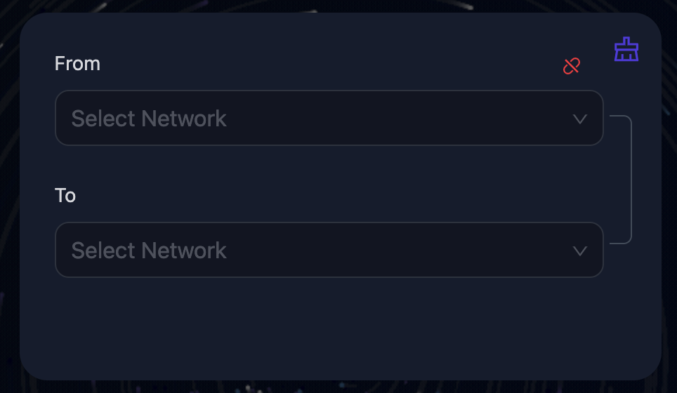

> 1. `Source network`: Click to select the source network.
1. `Target network`: Click to select the target network.
2. `Network connection status display`: The red icon means the network is currently disconnected, the green icon means the network is connected to the selected source network, and the yellow icon means the network is connected but doesn't match the selected source network.
3. `Network clear button`: You can clear the selected source and target network by clicking the *network clear button*.
> 

### Connect Network

Once you have selected the source network and the target network, you can connect to the source network by clicking the corresponding button below.

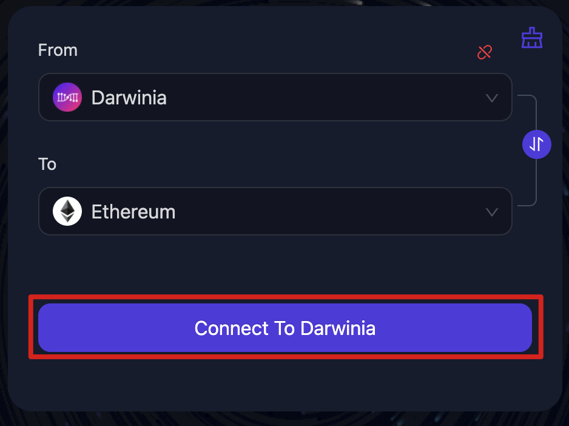

> 1. `Test network switch`: By default, only the official networks are displayed in the network selection panel. If you wish to use the test networks, you can turn it on/off by clicking the *Test network switch* on the top right of the page.
2. `Network quick switch button`: You can switch the source and target network by clicking the *Network quick switch button*.
3. `Network connection button`: Click to connect the source network.
> 

### Fill in the Transfer Form

Fill in the transfer form and make sure that the options are correct.

> NOTE: The required form information for each cross-chain transfer may vary because of the different source network and target network you chose, so please refer to the actual form for details.
> 

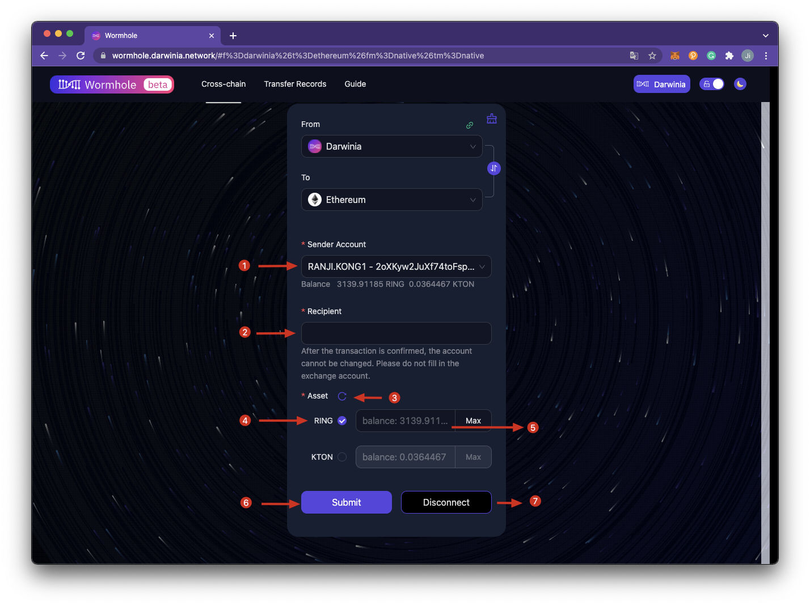

> 1. `Sender Account`: Click and select which account to transfer assets from in the drop list. The account in the drop list is read by Wormhole from the plugin.
2. `Recipient`: Fill in the account address to receive the assets from the sender account, and this address depends on the target network. eg. If you choose Ethereum as the target network, the recipient address must be an Ethereum address starting with "0x". ⚠️ Please do **NOT** fill in the exchange account address.
3. `Refresh button`: Click to refresh the balance of the asset.
4. `Asset chosen button`: There will be a tick icon behind the asset if you click it, it means that the asset has been selected and the corresponding transfer balance can be filled in this state.
5. `Asset balance`: Here displays the balance that can be used in the sender account.
6. `Submit button`: Click the button to enter the transfer assets process.
7. `Disconnect button`: Click to cancel the network connection.
> 

### Submit and Confirm Transfer Details

The assets you want to transfer must be greater than the cross-chain fee. As shown in the picture below.

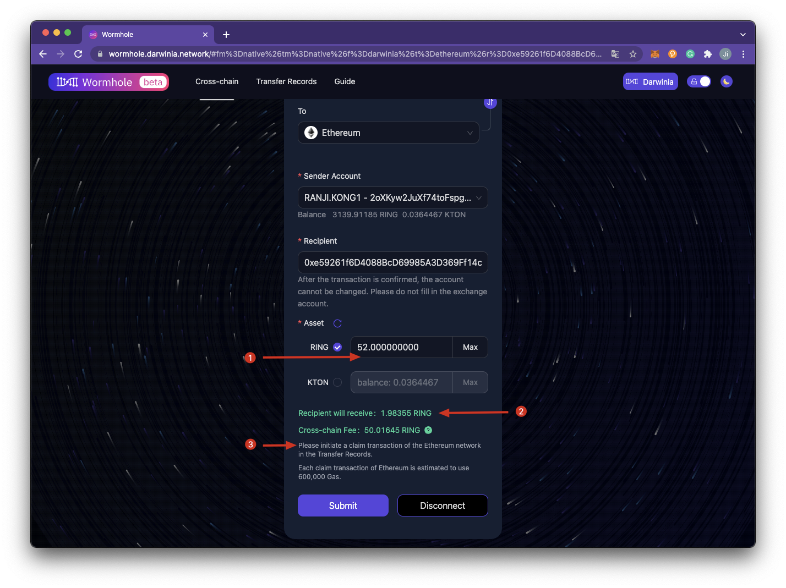

> 1. `Asset balance`: The assets you want to transfer must be greater than the cross-chain fee.
2. `Recipient will receive`: This amount is equal to the assets you want to transfer minus the cross-chain fee. The amount of the cross-chain fee will be queried in real-time during cross-chain operations, please refer to the actual result.
3. NOTE: Don't forget to claim your assets if you transfer assets from Darwinia Network to Ethereum, and each claim transaction of Ethereum is estimated to use 600,000 Gas.
> 

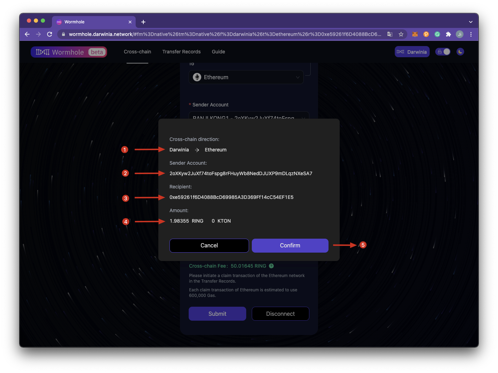

Confirm the cross-chain direction, sender account address, recipient address, and amount that the recipient address will receive. If there is no problem, click ***Confirm*** and sign the transaction. If there is any problem, you can click ***Cancel***.

### Sign the Transaction

Fill in the password for the sender account and sign the transaction.

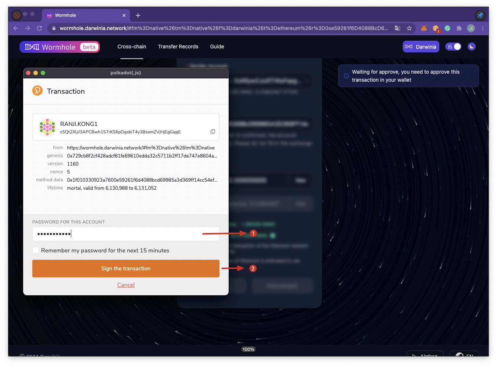

### Receive a Receipt

You will receive a receipt after the transaction is completed. You can check the transaction by viewing it in the corresponding explorer or tracking the process by clicking *Cross-chain history*.

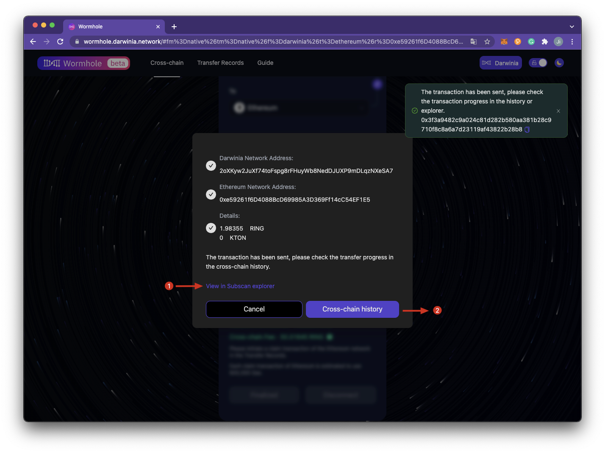

### Track the Transfer Records/Cross-chain History

You can click the *Cross-chain history* in your receipt or click *Transfer Records* on the homepage to track the transaction history. When you click *Transfer Records,* please select the source network and the target network first, and fill in the sender account address of the source network.

> NOTE: You will find different address formats(account formats) in the blockchain domain, which can sometimes be confusing for non-experts. Those who want a quick answer on which format to use in different scenarios can refer to [this article](https://darwinianetwork.medium.com/build-on-darwinia-2-1-address-formats-in-darwinia-e964cc91fccc).
> 

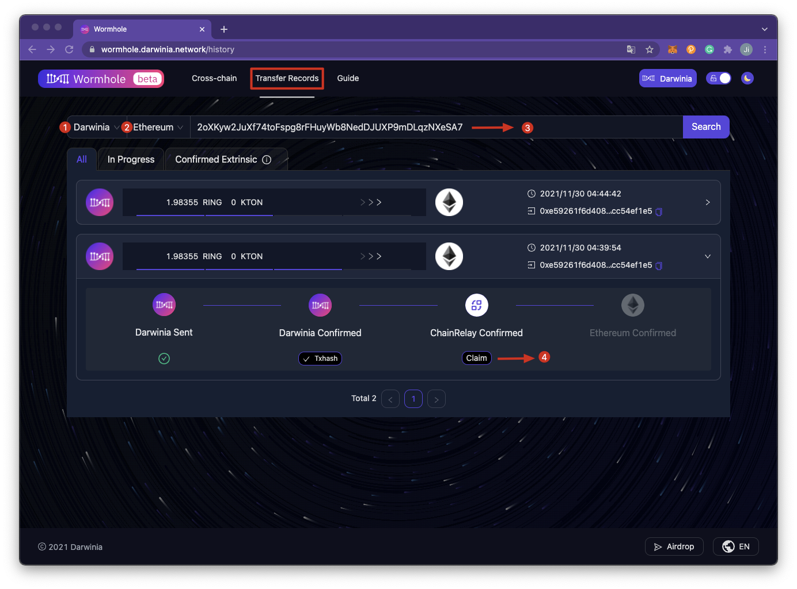

You can view completed transactions in *Confirmed Extrinsic*.

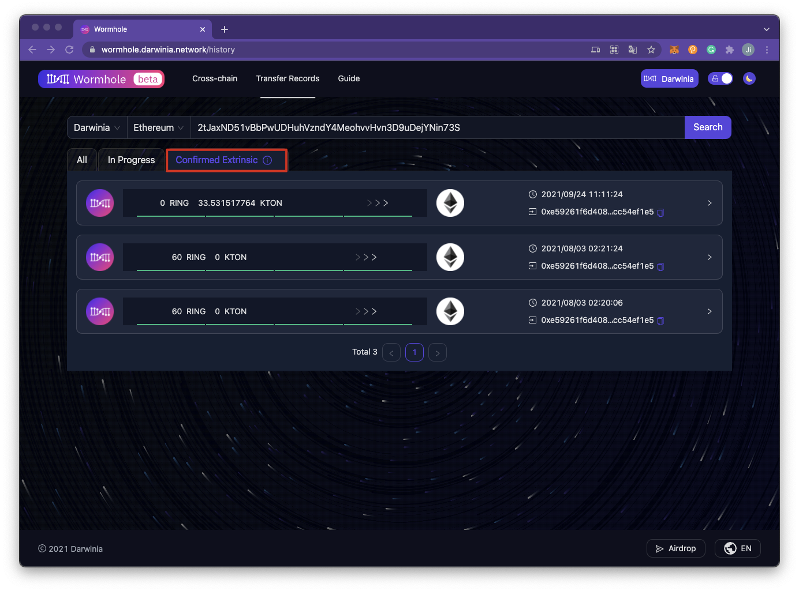

### Claim Assets

Claim your assets **only when you transfer assets from Darwinia Network to Ethereum**, ******and each claim transaction of Ethereum is estimated to use 600,000 Gas.
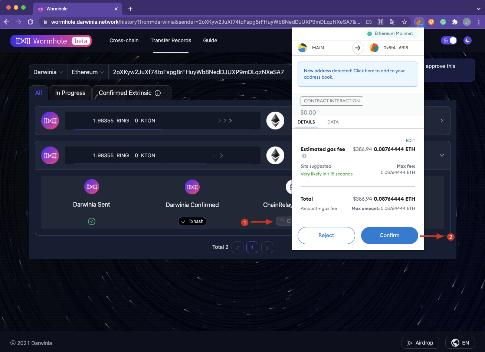

## FAQs

### Why is there no response after clicking the network connection button?

If there is no response after clicking the *network connection button*, please check whether the [polka{.js}](https://polkadot.js.org/extension/) extension is installed on your browser. If not, you can download [polkadot{.js}](https://polkadot.js.org/extension/) first for Chrome or Firefox and add it to your browser, then try to click the *network connection button* again.

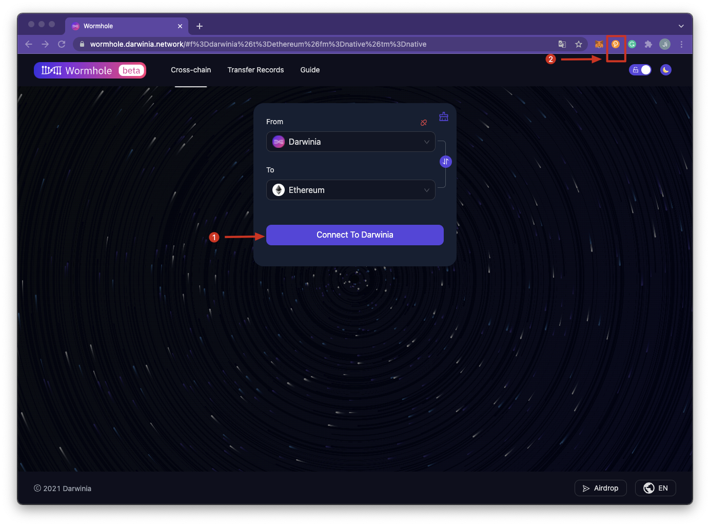

### Why can't I find the assets in the Ethereum address even if I've received the transfer receipt?

You need to claim your assets **after you transfer assets from Darwinia Network to Ethereum**. Click the ***Transfer Records*** on the homepage and select the source network and the target network first, fill in the sender account address of the source network, and claim assets.

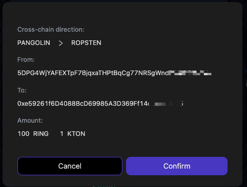

