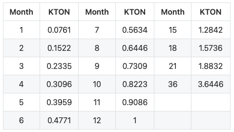

## RING

The native token for the Darwinia Network is RING, RING can be used as gas for transactions. Gas include transaction fees, contract execution fees, network bandwidth charges, storage fees, and more.

- Total Supply: Initial circulation (2 Billion), hard cap (10 Billion) in around 40 years
- Inflation Model: New RINGs are minted and distributed through the staking system and treasure as block producing rewards at a variable rate, see Staking#Inflation.

### Ring Allocation

- Financing: 30%, first round 10%, evaluation $10M, 20% remaining to be determined?
- Foundation: 20%, 5 years vesting period starts when mainnet launch?
- Team: 15%, 1 year vesting period starts after 1 year since mainnet lanuch?
- Business Development and Marketing: 15%
- Community: 20%, including airdrop

## KTON

KTON is essentially a derivative token of RING, which encourages long-term lock and commitment. RING staking participants can lock RING for 1-36s months and get KTON as rewards, compensating for the liquidity loss.

- The initial supply of KTON is 0, and it can only be obtained by locking RING. There is no other distribution channel. KTON has no impact on the function of  RING.

### Algorithm of binding RING for KTON

Users can lock a certain amount of RING for a predefined period of time in exchange for KTON in return. Basically bind 10,000 RING for 12 months to get 1 KTON.

1-36 variable integer months(30days) as the locking period are allowed. See the following table of rewarded KTON amount according to locked period.

